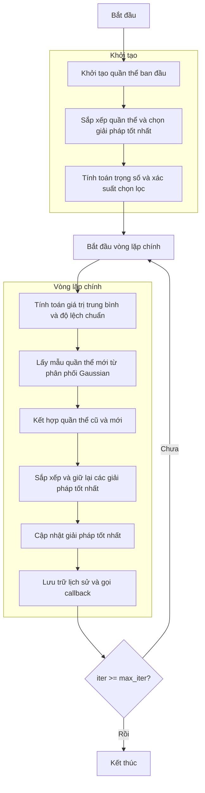

# Sơ đồ thuật toán Ant Colony Optimization for Continuous Domains (ACOR)



## Giải thích chi tiết các bước:

1. **Khởi tạo quần thể ban đầu**:
   - Tạo ngẫu nhiên các vị trí ban đầu trong không gian tìm kiếm
   - Mỗi vị trí X_i ∈ [lb, ub]^dim
   - Tính toán giá trị hàm mục tiêu objective_func(X_i)

2. **Sắp xếp quần thể và chọn giải pháp tốt nhất**:
   - Sắp xếp quần thể theo giá trị fitness
   - Chọn giải pháp tốt nhất làm giải pháp ban đầu

3. **Tính toán trọng số và xác suất chọn lọc**:
   - Tính trọng số Gaussian kernel cho từng giải pháp
   ```python
   w = (1 / (np.sqrt(2 * np.pi) * q * n_pop)) * np.exp(-0.5 * (((np.arange(n_pop)) / (q * n_pop)) ** 2))
   ```
   - Tính xác suất chọn lọc p = w / sum(w)

4. **Vòng lặp chính** (max_iter lần):
   - **Tính toán giá trị trung bình và độ lệch chuẩn**:
     * Lấy vị trí của tất cả giải pháp trong archive làm giá trị trung bình
     * Tính độ lệch chuẩn dựa trên khoảng cách trung bình đến các giải pháp khác
     ```python
     D = np.sum(np.abs(means[l] - means), axis=0)
     sigma[l] = zeta * D / (n_pop - 1)
     ```

   - **Lấy mẫu quần thể mới từ phân phối Gaussian**:
     * Với mỗi chiều, chọn một Gaussian kernel bằng bánh xe roulette
     * Tạo biến ngẫu nhiên Gaussian: new_position[i] = means[l, i] + sigma[l, i] * np.random.randn()
     * Đảm bảo vị trí nằm trong biên [lb, ub]

   - **Kết hợp quần thể cũ và mới**:
     * Gộp archive hiện tại và quần thể mới tạo thành

   - **Sắp xếp và giữ lại các giải pháp tốt nhất**:
     * Sắp xếp quần thể kết hợp theo fitness
     * Giữ lại chỉ các giải pháp tốt nhất (kích thước bằng archive ban đầu)

   - **Cập nhật giải pháp tốt nhất**:
     * So sánh và cập nhật nếu tìm thấy giải pháp tốt hơn

   - **Lưu trữ lịch sử và gọi callback**:
     * Lưu giải pháp tốt nhất hiện tại vào lịch sử
     * Cập nhật thanh tiến trình

5. **Kết thúc**:
   - Lưu trữ kết quả cuối cùng
   - Hiển thị lịch sử tối ưu hóa
   - Trả về giải pháp tốt nhất và lịch sử

## Tham số thuật toán:
- **q**: Hệ số cường độ hóa (selection pressure), mặc định 0.5
- **zeta**: Tỷ lệ khoảng cách độ lệch, mặc định 1.0
- **search_agents_no**: Kích thước archive/quần thể
- **max_iter**: Số lần lặp tối đa

## Đặc điểm thuật toán:
- Sử dụng archive các giải pháp tốt nhất
- Lấy mẫu từ phân phối Gaussian dựa trên các giải pháp trong archive
- Kết hợp cường độ hóa (khai thác) và đa dạng hóa (khám phá)
- Phù hợp cho các bài toán tối ưu liên tục
