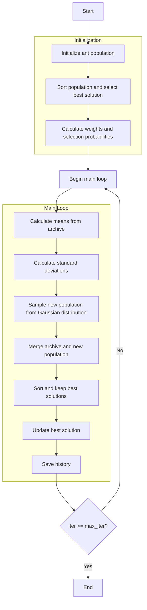

# Ant Colony Optimizer Algorithm Flowchart



### Detailed Step-by-Step Explanation:

1. **Initialize ant population**:
   - Randomly generate initial positions in the search space
   - Each position X_i ∈ [lb, ub]^dim
   - Calculate objective function values objective_func(X_i)

2. **Sort population and select best solution**:
   - Sort population based on fitness
   - Select initial best solution

3. **Calculate weights and selection probabilities**:
   - Calculate Gaussian kernel weights for each solution
   ```python
   w = (1 / (np.sqrt(2 * np.pi) * self.q * n_pop)) * 
        np.exp(-0.5 * (((np.arange(n_pop)) / (self.q * n_pop)) ** 2))
   ```
   - Calculate selection probabilities
   ```python
   p = w / np.sum(w)
   ```

4. **Main loop** (max_iter times):
   - **Calculate means from archive**:
     * Get positions of all solutions in the archive
     ```python
     means = np.array([member.position for member in population])
     ```

   - **Calculate standard deviations**:
     * Calculate standard deviation for each solution based on average distance
     ```python
     for l in range(n_pop):
         D = np.sum(np.abs(means[l] - means), axis=0)
         sigma[l] = self.zeta * D / (n_pop - 1)
     ```

   - **Sample new population from Gaussian distribution**:
     * Create new solutions by sampling from Gaussian distribution
     * For each solution component:
       - Select Gaussian kernel using roulette wheel selection
       - Generate Gaussian random variable
       ```python
       l = self._roulette_wheel_selection(probabilities)
       new_position[i] = means[l, i] + sigma[l, i] * np.random.randn()
       ```
     * Check boundaries and evaluate fitness

   - **Merge archive and new population**:
     * Combine current archive with new population

   - **Sort and keep best solutions**:
     * Sort merged population
     * Keep only the best solutions (archive size)

   - **Update best solution**:
     * Compare and update if better solution is found

   - **Save history**:
     * Store current best solution for optimization history

5. **End**:
   - Save final results
   - Display optimization history
   - Return best solution and history