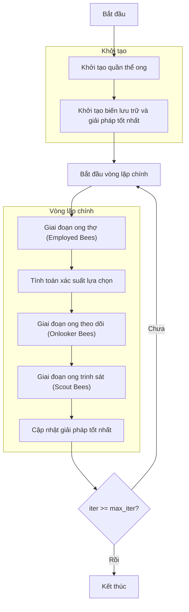

# Sơ đồ thuật toán Artificial Bee Colony Optimizer



## Giải thích chi tiết các bước:

1. **Khởi tạo quần thể ong**: 
   - Tạo ngẫu nhiên các vị trí ban đầu của ong (nguồn thức ăn)
   - Mỗi vị trí X_i ∈ [lb, ub]^dim
   - Tính toán giá trị hàm mục tiêu objective_func(X_i)
   - Khởi tạo bộ đếm trial = 0 cho mỗi ong

2. **Khởi tạo biến lưu trữ và giải pháp tốt nhất**:
   - Khởi tạo lịch sử tối ưu hóa
   - Tìm ong có fitness tốt nhất làm giải pháp tốt nhất ban đầu
   - Thiết lập tham số: số ong theo dõi (n_onlooker), giới hạn từ bỏ (abandonment_limit)

3. **Vòng lặp chính** (max_iter lần):
   - **Giai đoạn ong thợ (Employed Bees)**:
     * Mỗi ong thợ tìm kiếm xung quanh nguồn thức ăn hiện tại
     * Chọn ngẫu nhiên một ong hàng xóm khác
     * Tạo giải pháp mới:
       ```python
       phi = acceleration_coef * np.random.uniform(-1, 1, dim)
       new_position = current_position + phi * (current_position - neighbor_position)
       new_position = np.clip(new_position, lb, ub)
       ```
     * So sánh giải pháp mới với giải pháp cũ
     * Nếu tốt hơn: cập nhật vị trí và reset trial = 0
     * Nếu không tốt hơn: tăng trial counter lên 1

   - **Tính toán xác suất lựa chọn**:
     * Chuyển đổi fitness thành xác suất lựa chọn
     * Đối với bài toán minimization:
       ```python
       costs = [bee.fitness for bee in population]
       max_cost = np.max(costs)
       fitness_values = max_cost - costs + 1e-10
       probabilities = fitness_values / np.sum(fitness_values)
       ```
     * Đối với bài toán maximization:
       ```python
       fitness_values = [bee.fitness for bee in population]
       probabilities = fitness_values / np.sum(fitness_values)
       ```

   - **Giai đoạn ong theo dõi (Onlooker Bees)**:
     * Ong theo dõi chọn nguồn thức ăn dựa trên xác suất (roulette wheel selection)
     * Mỗi ong theo dõi tìm kiếm xung quanh nguồn thức ăn được chọn
     * Tạo giải pháp mới tương tự ong thợ
     * So sánh và cập nhật tương tự ong thợ

   - **Giai đoạn ong trinh sát (Scout Bees)**:
     * Kiểm tra bộ đếm trial của mỗi ong
     * Nếu trial >= abandonment_limit:
       ```python
       # Từ bỏ nguồn thức ăn và tạo ngẫu nhiên nguồn mới
       new_position = np.random.uniform(lb, ub, dim)
       new_fitness = objective_func(new_position)
       trial = 0  # Reset bộ đếm
       ```

   - **Cập nhật giải pháp tốt nhất**:
     * Sắp xếp quần thể và tìm giải pháp tốt nhất hiện tại
     * So sánh với giải pháp tốt nhất toàn cục
     * Cập nhật nếu tìm thấy giải pháp tốt hơn

4. **Kết thúc**:
   - Lưu trữ kết quả cuối cùng
   - Hiển thị lịch sử tối ưu hóa
   - Trả về giải pháp tốt nhất và lịch sử

## Đặc điểm thuật toán ABC:
- **Mô phỏng hành vi tìm kiếm thức ăn của ong**: ong thợ, ong theo dõi, ong trinh sát
- **Cân bằng exploration và exploitation**: ong thợ khám phá, ong theo dõi khai thác
- **Cơ chế từ bỏ**: loại bỏ các nguồn thức ăn kém hiệu quả
- **Lựa chọn dựa trên fitness**: ong theo dõi chọn nguồn thức ăn tốt với xác suất cao hơn
- **Tham số điều chỉnh**: acceleration_coef điều khiển bước tìm kiếm, abandonment_limit kiểm soát việc từ bỏ
