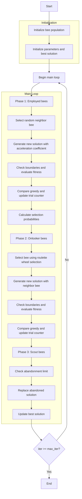

# Artificial Bee Colony Optimizer Algorithm Flowchart



### Detailed Explanation of Steps:

1. **Initialize bee population**:
   - Randomly create initial positions within the search space
   - Each position X_i ∈ [lb, ub]^dim
   - Calculate objective function value objective_func(X_i)
   - Initialize trial counter = 0 for each bee

2. **Initialize parameters and best solution**:
   - Set number of onlooker bees (n_onlooker)
   - Set abandonment limit (trial limit)
   - Select initial best solution from population

3. **Main loop** (max_iter times):
   - **Phase 1: Employed bees**:
     * Each employed bee searches for a new solution

     - **Select random neighbor bee**:
       * Randomly select another bee from the population

     - **Generate new solution with acceleration coefficient**:
       ```python
       phi = self.acceleration_coef * np.random.uniform(-1, 1, self.dim)
       new_position = population[i].position + phi * (population[i].position - population[k].position)
       ```

     - **Check boundaries and evaluate fitness**:
       * Ensure position remains within [lb, ub]
       * Calculate new objective function value

     - **Compare greedy and update trial counter**:
       * If new solution is better: update position and reset trial counter
       * Otherwise: increase trial counter

   - **Calculate selection probabilities**:
     * Calculate fitness values and selection probabilities for onlooker bees
     ```python
     if not self.maximize:
         costs = np.array([bee.fitness for bee in population])
         max_cost = np.max(costs)
         fitness_values = max_cost - costs + 1e-10
     else:
         fitness_values = np.array([bee.fitness for bee in population])
     probabilities = fitness_values / np.sum(fitness_values)
     ```

   - **Phase 2: Onlooker bees**:
     * Onlooker bees select employed bees based on probabilities

     - **Select bee using roulette wheel selection**:
       * Use fitness-proportional selection

     - **Generate new solution with neighbor bee**:
       * Similar to employed bee phase

     - **Check boundaries and evaluate fitness**:
       * Ensure valid position

     - **Compare greedy and update trial counter**:
       * Update solution if better

   - **Phase 3: Scout bees**:
     * Replace solutions that haven't improved

     - **Check abandonment limit**:
       * If trial counter >= abandonment_limit

     - **Replace abandoned solution**:
       * Create new random solution
       * Reset trial counter

   - **Update best solution**:
     * Find and save current best solution

4. **End**:
   - Store final results
   - Display optimization history
   - Return best solution and history