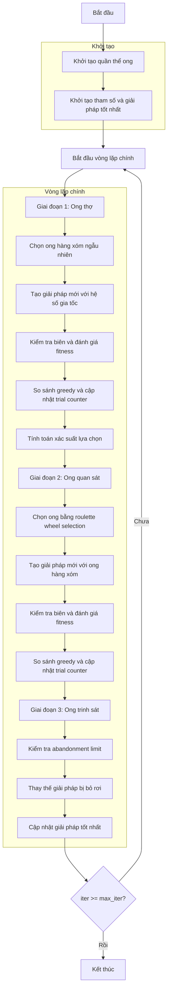

# Sơ đồ thuật toán Artificial Bee Colony Optimizer



### Giải thích chi tiết các bước:

1. **Khởi tạo quần thể ong**: 
   - Tạo ngẫu nhiên các vị trí ban đầu trong không gian tìm kiếm
   - Mỗi vị trí X_i ∈ [lb, ub]^dim
   - Tính toán giá trị hàm mục tiêu objective_func(X_i)
   - Khởi tạo trial counter = 0 cho mỗi ong

2. **Khởi tạo tham số và giải pháp tốt nhất**:
   - Thiết lập số lượng ong quan sát (n_onlooker)
   - Thiết lập abandonment limit (giới hạn thử nghiệm)
   - Chọn giải pháp tốt nhất ban đầu từ quần thể

3. **Vòng lặp chính** (max_iter lần):
   - **Giai đoạn 1: Ong thợ**:
     * Mỗi ong thợ tìm kiếm giải pháp mới

     - **Chọn ong hàng xóm ngẫu nhiên**:
       * Chọn một ong khác ngẫu nhiên từ quần thể

     - **Tạo giải pháp mới với hệ số gia tốc**:
       ```python
       phi = self.acceleration_coef * np.random.uniform(-1, 1, self.dim)
       new_position = population[i].position + phi * (population[i].position - population[k].position)
       ```

     - **Kiểm tra biên và đánh giá fitness**:
       * Đảm bảo vị trí nằm trong [lb, ub]
       * Tính toán giá trị hàm mục tiêu mới

     - **So sánh greedy và cập nhật trial counter**:
       * Nếu giải pháp mới tốt hơn: cập nhật vị trí và reset trial counter
       * Nếu không: tăng trial counter

   - **Tính toán xác suất lựa chọn**:
     * Tính fitness values và xác suất lựa chọn cho ong quan sát
     ```python
     if not self.maximize:
         costs = np.array([bee.fitness for bee in population])
         max_cost = np.max(costs)
         fitness_values = max_cost - costs + 1e-10
     else:
         fitness_values = np.array([bee.fitness for bee in population])
     probabilities = fitness_values / np.sum(fitness_values)
     ```

   - **Giai đoạn 2: Ong quan sát**:
     * Ong quan sát chọn ong thợ dựa trên xác suất

     - **Chọn ong bằng roulette wheel selection**:
       * Sử dụng lựa chọn tỷ lệ fitness

     - **Tạo giải pháp mới với ong hàng xóm**:
       * Tương tự giai đoạn ong thợ

     - **Kiểm tra biên và đánh giá fitness**:
       * Đảm bảo vị trí hợp lệ

     - **So sánh greedy và cập nhật trial counter**:
       * Cập nhật giải pháp nếu tốt hơn

   - **Giai đoạn 3: Ong trinh sát**:
     * Thay thế các giải pháp không cải thiện

     - **Kiểm tra abandonment limit**:
       * Nếu trial counter >= abandonment_limit

     - **Thay thế giải pháp bị bỏ rơi**:
       * Tạo giải pháp ngẫu nhiên mới
       * Reset trial counter

   - **Cập nhật giải pháp tốt nhất**:
     * Tìm và lưu giải pháp tốt nhất hiện tại

4. **Kết thúc**:
   - Lưu trữ kết quả cuối cùng
   - Hiển thị lịch sử tối ưu hóa
   - Trả về giải pháp tốt nhất và lịch sử
