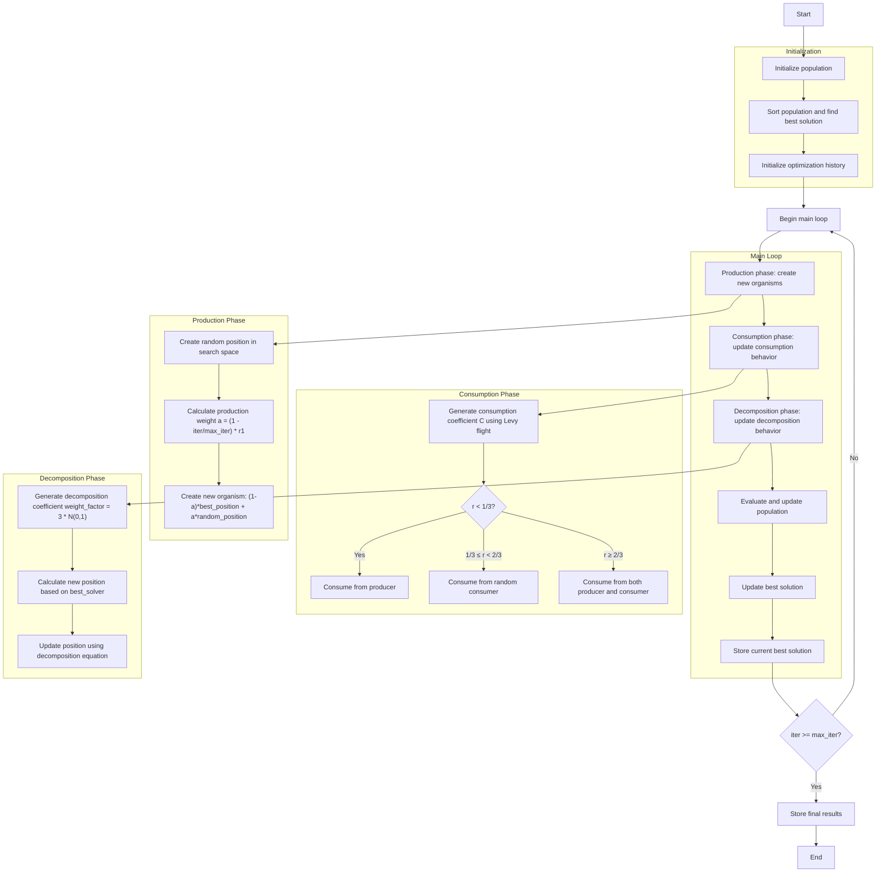

# Artificial Ecosystem Optimizer Algorithm Flowchart



### Detailed Step-by-Step Explanation:

1. **Initialize population**:
   - Randomly create initial positions in the search space
   - Each organism has a position and fitness value
   - Calculate objective function value: objective_func(position)

2. **Sort population and find best solution**:
   - Sort population by fitness order
   - Select the best solution as best_solver

3. **Initialize optimization history**:
   - Initialize a list to store the history of best solutions

4. **Main loop** (max_iter times):
   - **Production phase**:
     * Create new organisms based on the best position and random positions
     * Production weight decreases gradually with iterations
     ```python
     a = (1 - iter / max_iter) * r1
     new_position = (1 - a) * best_position + a * random_position
     ```

   - **Consumption phase**:
     * Organisms update positions based on consumption behavior
     * Use consumption coefficient C calculated by Levy flight
     ```python
     u = np.random.normal(0, 1, self.dim)
     v = np.random.normal(0, 1, self.dim)
     C = 0.5 * u / np.abs(v)
     ```
     * Three consumption strategies:
       - Consume from producer (probability < 1/3)
       - Consume from random consumer (1/3 ≤ probability < 2/3)
       - Consume from both producer and consumer (probability ≥ 2/3)

   - **Decomposition phase**:
     * Organisms update positions based on decomposition behavior
     * Use decomposition coefficient weight_factor
     ```python
     weight_factor = 3 * np.random.normal(0, 1)
     new_position = best_solver.position + weight_factor * (
         (r3 * random_multiplier - 1) * best_solver.position -
         (2 * r3 - 1) * population[i].position
     )
     ```

   - **Evaluate and update population**:
     * Compare new population with old population
     * Keep better solutions

   - **Update best solution**:
     * Compare and update if a better solution is found

   - **Store current best solution**:
     * Store best_solver in history

5. **End**:
   - Store final results
   - Display optimization history
   - Return the best solution and history