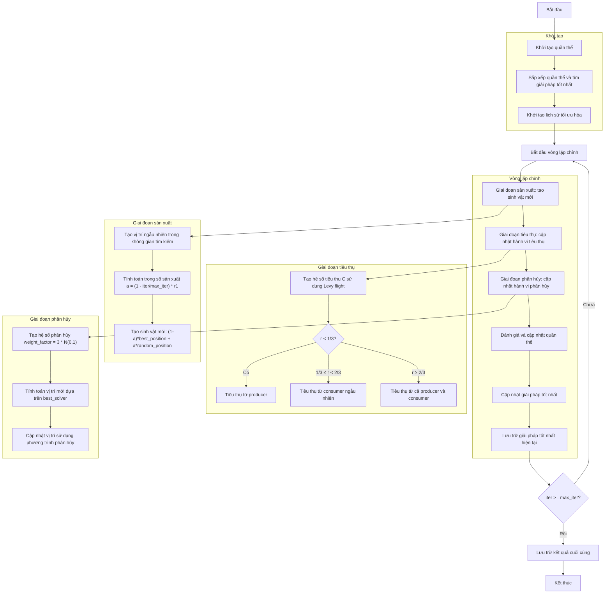

# Sơ đồ thuật toán Artificial Ecosystem Optimizer



### Giải thích chi tiết các bước:

1. **Khởi tạo quần thể**:
   - Tạo ngẫu nhiên các vị trí ban đầu trong không gian tìm kiếm
   - Mỗi sinh vật có vị trí và giá trị fitness
   - Tính toán giá trị hàm mục tiêu objective_func(position)

2. **Sắp xếp quần thể và tìm giải pháp tốt nhất**:
   - Sắp xếp quần thể theo thứ tự fitness
   - Chọn giải pháp tốt nhất làm best_solver

3. **Khởi tạo lịch sử tối ưu hóa**:
   - Khởi tạo danh sách lưu trữ lịch sử các giải pháp tốt nhất

4. **Vòng lặp chính** (max_iter lần):
   - **Giai đoạn sản xuất**:
     * Tạo sinh vật mới dựa trên vị trí tốt nhất và vị trí ngẫu nhiên
     * Trọng số sản xuất giảm dần theo số lần lặp
     ```python
     a = (1 - iter / max_iter) * r1
     new_position = (1 - a) * best_position + a * random_position
     ```

   - **Giai đoạn tiêu thụ**:
     * Các sinh vật cập nhật vị trí dựa trên hành vi tiêu thụ
     * Sử dụng hệ số tiêu thụ C tính bằng Levy flight
     ```python
     u = np.random.normal(0, 1, self.dim)
     v = np.random.normal(0, 1, self.dim)
     C = 0.5 * u / np.abs(v)
     ```
     * Ba chiến lược tiêu thụ:
       - Tiêu thụ từ producer (xác suất < 1/3)
       - Tiêu thụ từ consumer ngẫu nhiên (1/3 ≤ xác suất < 2/3)
       - Tiêu thụ từ cả producer và consumer (xác suất ≥ 2/3)

   - **Giai đoạn phân hủy**:
     * Các sinh vật cập nhật vị trí dựa trên hành vi phân hủy
     * Sử dụng hệ số phân hủy weight_factor
     ```python
     weight_factor = 3 * np.random.normal(0, 1)
     new_position = best_solver.position + weight_factor * (
         (r3 * random_multiplier - 1) * best_solver.position -
         (2 * r3 - 1) * population[i].position
     )
     ```

   - **Đánh giá và cập nhật quần thể**:
     * So sánh quần thể mới và quần thể cũ
     * Giữ lại các giải pháp tốt hơn

   - **Cập nhật giải pháp tốt nhất**:
     * So sánh và cập nhật nếu tìm thấy giải pháp tốt hơn

   - **Lưu trữ giải pháp tốt nhất hiện tại**:
     * Lưu trữ best_solver vào lịch sử

5. **Kết thúc**:
   - Lưu trữ kết quả cuối cùng
   - Hiển thị lịch sử tối ưu hóa
   - Trả về giải pháp tốt nhất và lịch sử
