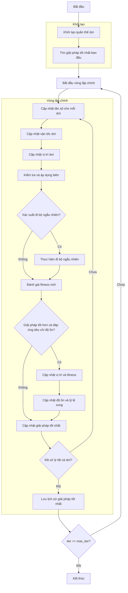

# Sơ đồ thuật toán Bat Optimizer



## Giải thích chi tiết các bước:

1. **Khởi tạo quần thể dơi**:
   - Tạo ngẫu nhiên các vị trí ban đầu trong không gian tìm kiếm
   - Mỗi dơi có các tham số đặc trưng: tần số, vận tốc, độ ồn, tỷ lệ xung
   - Tính toán giá trị hàm mục tiêu ban đầu

2. **Tìm giải pháp tốt nhất ban đầu**:
   - Sắp xếp quần thể dơi dựa trên giá trị fitness
   - Chọn dơi có giải pháp tốt nhất làm best_solution

3. **Vòng lặp chính** (max_iter lần):
   - **Cập nhật tần số cho mỗi dơi**:
     ```python
     frequency = fmin + (fmax - fmin) * random()
     ```
   
   - **Cập nhật vận tốc dơi**:
     ```python
     velocity = velocity + (position - best_position) * frequency
     ```
   
   - **Cập nhật vị trí dơi**:
     ```python
     new_position = position + velocity
     ```
   
   - **Kiểm tra và áp dụng biên**:
     ```python
     new_position = np.clip(new_position, lb, ub)
     ```
   
   - **Xác suất đi bộ ngẫu nhiên**:
     * Nếu random() > pulse_rate, thực hiện đi bộ ngẫu nhiên
     ```python
     epsilon = -1 + 2 * random()
     mean_loudness = np.mean([bat.loudness for bat in population])
     new_position = best_position + epsilon * mean_loudness
     ```
   
   - **Đánh giá fitness mới**:
     * Tính toán giá trị hàm mục tiêu cho vị trí mới
   
   - **Kiểm tra điều kiện cập nhật**:
     * Nếu giải pháp tốt hơn và random() < loudness
     * Cập nhật vị trí và fitness
     * Cập nhật độ ồn và tỷ lệ xung:
       ```python
       loudness = alpha * loudness
       pulse_rate = ro * (1 - exp(-gamma * iter))
       ```
   
   - **Cập nhật giải pháp tốt nhất**:
     * So sánh và cập nhật nếu tìm thấy giải pháp tốt hơn

4. **Lưu lịch sử giải pháp tốt nhất**:
   - Lưu trữ best_solution của mỗi iteration

5. **Kết thúc**:
   - Lưu trữ kết quả cuối cùng
   - Hiển thị lịch sử tối ưu hóa
   - Trả về giải pháp tốt nhất và lịch sử

## Tham số thuật toán:
- **fmin, fmax**: Phạm vi tần số (mặc định: 0.0, 2.0)
- **alpha**: Hằng số suy giảm độ ồn (mặc định: 0.9)
- **gamma**: Hằng số tăng tỷ lệ xung (mặc định: 0.9)
- **ro**: Tỷ lệ xung ban đầu (mặc định: 0.5)

## Đặc điểm thuật toán:
- Mô phỏng hành vi định vị bằng tiếng vang của dơi
- Sử dụng tần số để điều chỉnh vận tốc tìm kiếm
- Độ ồn kiểm soát khả năng chấp nhận giải pháp mới
- Tỷ lệ xung điều khiển xác suất đi bộ ngẫu nhiên
- Thích ứng động các tham số trong quá trình tối ưu hóa
