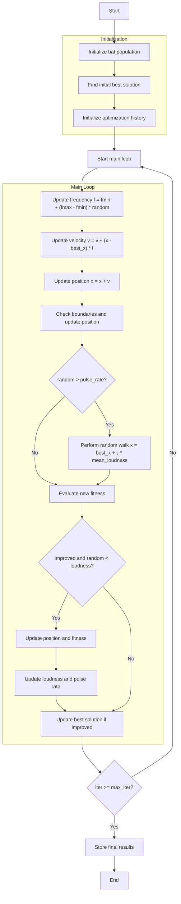

# Bat Optimizer Algorithm Flowchart



### Detailed Step-by-Step Explanation:

1. **Initialize bat population**:
   - Randomly generate initial positions within the search space
   - Each bat has parameters: position, fitness, frequency, velocity, loudness, pulse_rate
   - Calculate objective function value: objective_func(position)

2. **Find initial best solution**:
   - Sort the population and select the best solution as best_solution

3. **Initialize optimization history**:
   - Initialize a list to store the history of best solutions

4. **Main loop** (max_iter times):
   - **Update frequency**:
     * Each bat updates its frequency randomly within [fmin, fmax] range
     ```python
     frequency = fmin + (fmax - fmin) * np.random.random()
     ```

   - **Update velocity**:
     * Update velocity toward the best solution
     ```python
     velocity = velocity + (position - best_solution.position) * frequency
     ```

   - **Update position**:
     * Move the bat according to the new velocity
     ```python
     new_position = position + velocity
     ```

   - **Check boundaries**:
     * Ensure position stays within bounds [lb, ub]

   - **Random walk**:
     * With probability (1 - pulse_rate), perform a random walk
     ```python
     if np.random.random() > pulse_rate:
         epsilon = -1 + 2 * np.random.random()
         new_position = best_solution.position + epsilon * mean_loudness
     ```

   - **Evaluate new fitness**:
     * Calculate objective function value for the new position

   - **Update solution**:
     * If the new solution is better and meets the loudness condition
     ```python
     if self._is_better(new_bat, population[i]) and np.random.random() < loudness:
         # Update position and fitness
         # Update loudness and pulse rate
         loudness = alpha * loudness
         pulse_rate = ro * (1 - np.exp(-gamma * iter))
     ```

   - **Update best solution**:
     * Compare and update if a better solution is found

5. **Termination**:
   - Store final results
   - Display optimization history
   - Return the best solution and history