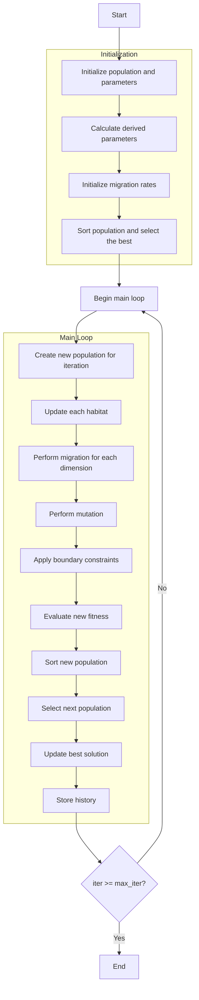

# Algorithm Flowchart of Biogeography-Based Optimizer



### Detailed Explanation of Steps:

1. **Initialize population and parameters**:
   - Randomly create initial habitats
   - Set algorithm parameters:
     * Keep rate (keep_rate)
     * Migration coefficient (alpha)
     * Mutation probability (p_mutation)
     * Mutation step size (sigma)

2. **Calculate derived parameters**:
   - Calculate number of habitats to retain
   - Calculate number of new habitats
   ```python
   n_keep = round(self.keep_rate * search_agents_no)
   n_new = search_agents_no - n_keep
   ```

3. **Initialize migration rates**:
   - Emigration rates decrease gradually
   - Immigration rates increase gradually
   ```python
   mu = np.linspace(1, 0, search_agents_no)
   lambda_rates = 1 - mu
   ```

4. **Sort population and select the best**:
   - Sort habitats by fitness
   - Select initial best solution

5. **Main loop** (max_iter times):
   - **Create new population for iteration**:
     * Copy current population
   
   - **Update each habitat**:
     * Process each habitat individually
   
   - **Perform migration for each dimension**:
     * If random number ≤ immigration rate:
       * Calculate emigration probability (excluding current habitat)
       * Select source habitat using roulette wheel
       * Perform migration with coefficient alpha
       ```python
       new_population[i].position[k] = population[i].position[k] + self.alpha * (population[j].position[k] - population[i].position[k])
       ```
   
   - **Perform mutation**:
     * If random number ≤ mutation probability:
       * Add Gaussian noise with standard deviation sigma
   
   - **Apply boundary constraints**:
     * Ensure positions remain within bounds [lb, ub]
   
   - **Evaluate new fitness**:
     * Calculate new objective function value
   
   - **Sort new population**:
     * Sort habitats by fitness
   
   - **Select next population**:
     * Retain best habitats + new habitats
     ```python
     next_population = sorted_population[:n_keep] + sorted_new_population[:n_new]
     ```
   
   - **Update best solution**:
     * Compare and update if better solution is found
   
   - **Store history**:
     * Save best solution at each iteration

6. **End**:
   - Store final results
   - Display optimization history
   - Return best solution