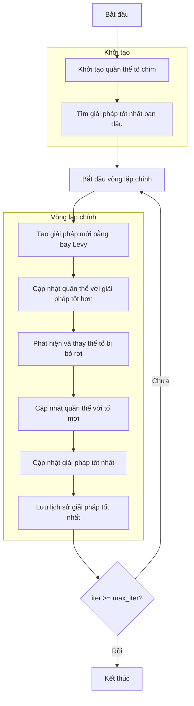

# Sơ đồ thuật toán Cuckoo Search Optimizer



## Giải thích chi tiết các bước:

1. **Khởi tạo quần thể tổ chim**:
   - Tạo ngẫu nhiên các vị trí ban đầu trong không gian tìm kiếm
   - Mỗi tổ chim đại diện cho một giải pháp tiềm năng
   - Tính toán giá trị hàm mục tiêu ban đầu

2. **Tìm giải pháp tốt nhất ban đầu**:
   - Sắp xếp quần thể tổ chim dựa trên giá trị fitness
   - Chọn tổ có giải pháp tốt nhất làm best_solution

3. **Vòng lặp chính** (max_iter lần):
   - **Tạo giải pháp mới bằng bay Levy**:
     * Mô phỏng hành vi bay Levy của chim cu
     * Tạo bước bay ngẫu nhiên với phân phối Levy
     ```python
     step = levy_flight(dim, beta)
     step_size = 0.01 * step * (position - best_position)
     new_position = position + step_size * random.randn(dim)
     ```
   
   - **Cập nhật quần thể với giải pháp tốt hơn**:
     * So sánh giải pháp mới với giải pháp hiện tại
     * Chỉ giữ lại giải pháp tốt hơn
     ```python
     if is_better(new_solution, current_solution):
         keep new_solution
     else:
         keep current_solution
     ```
   
   - **Phát hiện và thay thế tổ bị bỏ rơi**:
     * Với xác suất pa, tổ chim bị phát hiện và bỏ rơi
     * Tạo tổ mới bằng cách đi bộ ngẫu nhiên
     ```python
     discovery_status = random.random() > pa
     if discovered:
         idx1, idx2 = random.choice(population, 2)
         step_size = random.random() * (position1 - position2)
         new_position = current_position + step_size
     ```
   
   - **Cập nhật quần thể với tổ mới**:
     * So sánh và giữ lại giải pháp tốt hơn
     * Đảm bảo các giải pháp nằm trong biên cho phép
     ```python
     new_position = np.clip(new_position, lb, ub)
     ```
   
   - **Cập nhật giải pháp tốt nhất**:
     * So sánh và cập nhật nếu tìm thấy giải pháp tốt hơn
     ```python
     if is_better(current_best, best_solution):
         best_solution = current_best.copy()
     ```

4. **Lưu lịch sử giải pháp tốt nhất**:
   - Lưu trữ best_solution của mỗi iteration
   - Theo dõi quá trình hội tụ của thuật toán

5. **Kết thúc**:
   - Lưu trữ kết quả cuối cùng
   - Hiển thị lịch sử tối ưu hóa
   - Trả về giải pháp tốt nhất và lịch sử

## Tham số thuật toán:
- **pa**: Tỷ lệ phát hiện tổ bị bỏ rơi (mặc định: 0.25)
- **beta**: Số mũ Levy cho bước bay (mặc định: 1.5)

## Đặc điểm thuật toán:
- Mô phỏng hành vi ký sinh trứng của chim cu
- Sử dụng bay Levy để khám phá không gian tìm kiếm hiệu quả
- Cơ chế phát hiện và thay thế tổ bỏ rơi giúp tránh cực trị địa phương
- Kết hợp khám phá (exploration) và khai thác (exploitation)
- Bay Levy cho phép tìm kiếm với các bước dài ngẫu nhiên

## Công thức bay Levy:
Bay Levy là một loại random walk với các bước có độ dài tuân theo phân phối xác suất nặng đuôi:
```python
# Hàm levy_flight từ src/_general.py
def levy_flight(dim, beta=1.5):
    sigma = (gamma(1 + beta) * np.sin(np.pi * beta / 2) / 
            (gamma((1 + beta) / 2) * beta * 2**((beta - 1) / 2)))**(1 / beta)
    u = np.random.normal(0, sigma, dim)
    v = np.random.normal(0, 1, dim)
    step = u / np.abs(v)**(1 / beta)
    return step
```

## Ưu điểm của Cuckoo Search:
- Đơn giản và dễ triển khai
- Hiệu quả trong việc tránh cực trị địa phương
- Cân bằng tốt giữa khám phá và khai thác
- Phù hợp cho các bài toán tối ưu hóa đa chiều
