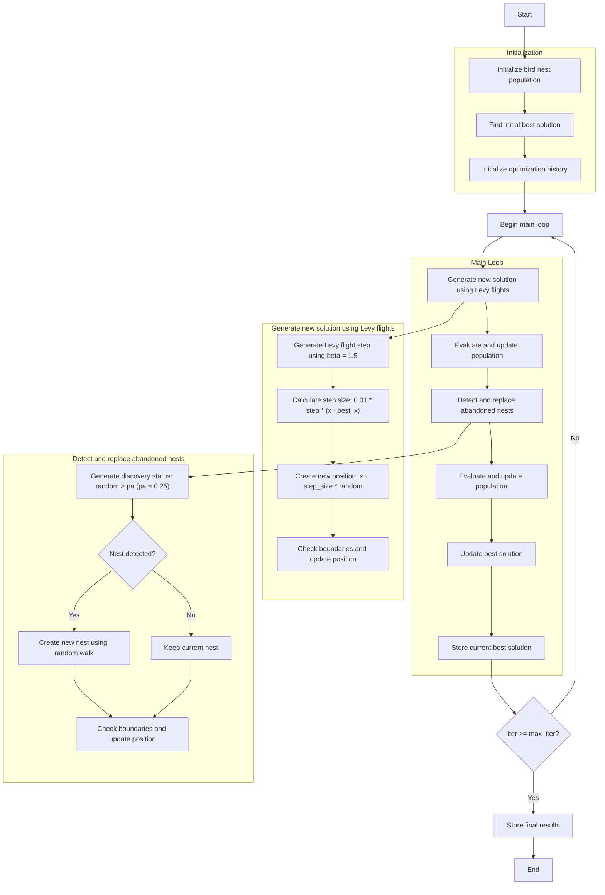

# Cuckoo Search Optimizer Algorithm Flowchart



### Detailed Step Explanations:

1. **Initialize bird nest population**:
   - Randomly create initial positions within the search space
   - Each bird nest has a position and fitness value
   - Calculate objective function value: objective_func(position)

2. **Find initial best solution**:
   - Sort the population and select the best solution as best_solution

3. **Initialize optimization history**:
   - Initialize a list to store the history of best solutions

4. **Main loop** (max_iter times):
   - **Generate new solution using Levy flights**:
     * Each bird nest creates a new solution using Levy flight
     * Use beta coefficient = 1.5 for Levy flight
     ```python
     step = self._levy_flight()  # Using beta = 1.5
     step_size = 0.01 * step * (member.position - best_solution.position)
     new_position = member.position + step_size * np.random.randn(self.dim)
     ```
     * Check boundaries to ensure positions remain within [lb, ub]

   - **Evaluate and update population**:
     * Compare new population with old population
     * Keep better solutions

   - **Detect and replace abandoned nests**:
     * With probability pa = 0.25, bird nests are detected and abandoned
     ```python
     discovery_status = np.random.random(n) > self.pa  # pa = 0.25
     ```
     * Create new nests using random walk:
     ```python
     idx1, idx2 = np.random.choice(n, 2, replace=False)
     step_size = np.random.random() * (population[idx1].position - population[idx2].position)
     new_position = population[i].position + step_size
     ```
     * Keep nests that are not detected

   - **Evaluate and update population**:
     * Compare new population with old population
     * Keep better solutions

   - **Update best solution**:
     * Compare and update if a better solution is found

   - **Store current best solution**:
     * Store best_solution in history

5. **End**:
   - Store final results
   - Display optimization history
   - Return the best solution and history