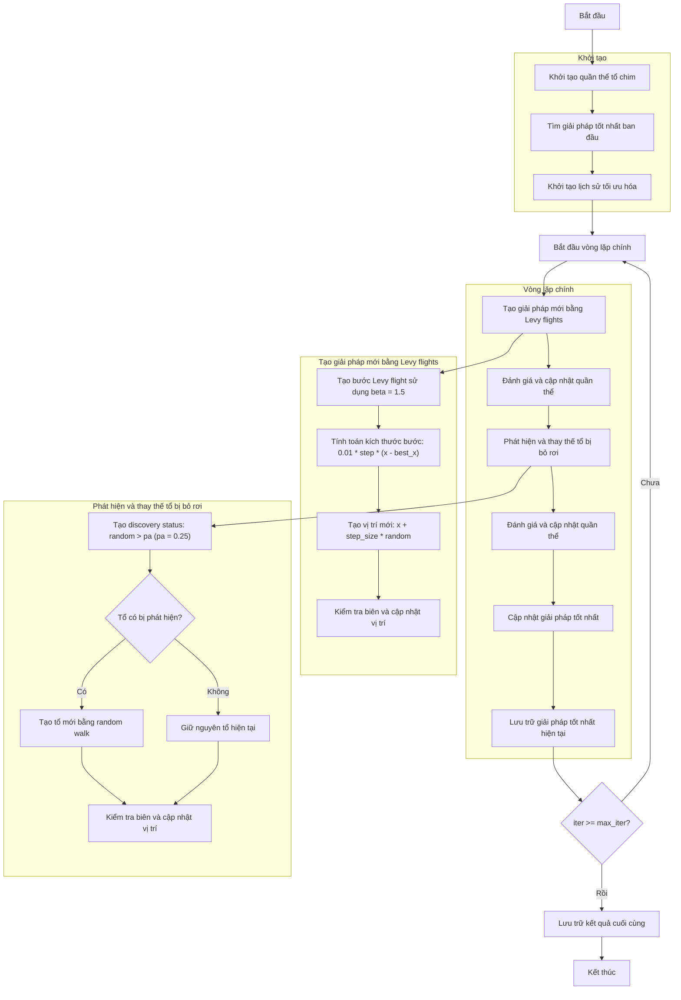

# Sơ đồ thuật toán Cuckoo Search Optimizer



### Giải thích chi tiết các bước:

1. **Khởi tạo quần thể tổ chim**:
   - Tạo ngẫu nhiên các vị trí ban đầu trong không gian tìm kiếm
   - Mỗi tổ chim có vị trí và giá trị fitness
   - Tính toán giá trị hàm mục tiêu objective_func(position)

2. **Tìm giải pháp tốt nhất ban đầu**:
   - Sắp xếp quần thể và chọn giải pháp tốt nhất làm best_solution

3. **Khởi tạo lịch sử tối ưu hóa**:
   - Khởi tạo danh sách lưu trữ lịch sử các giải pháp tốt nhất

4. **Vòng lặp chính** (max_iter lần):
   - **Tạo giải pháp mới bằng Levy flights**:
     * Mỗi tổ chim tạo giải pháp mới sử dụng Levy flight
     * Sử dụng hệ số beta = 1.5 cho Levy flight
     ```python
     step = self._levy_flight()  # Sử dụng beta = 1.5
     step_size = 0.01 * step * (member.position - best_solution.position)
     new_position = member.position + step_size * np.random.randn(self.dim)
     ```
     * Kiểm tra biên để đảm bảo vị trí nằm trong [lb, ub]

   - **Đánh giá và cập nhật quần thể**:
     * So sánh quần thể mới và quần thể cũ
     * Giữ lại các giải pháp tốt hơn

   - **Phát hiện và thay thế tổ bị bỏ rơi**:
     * Với xác suất pa = 0.25, các tổ chim bị phát hiện và bỏ rơi
     ```python
     discovery_status = np.random.random(n) > self.pa  # pa = 0.25
     ```
     * Tạo tổ mới bằng random walk:
     ```python
     idx1, idx2 = np.random.choice(n, 2, replace=False)
     step_size = np.random.random() * (population[idx1].position - population[idx2].position)
     new_position = population[i].position + step_size
     ```
     * Giữ nguyên các tổ không bị phát hiện

   - **Đánh giá và cập nhật quần thể**:
     * So sánh quần thể mới và quần thể cũ
     * Giữ lại các giải pháp tốt hơn

   - **Cập nhật giải pháp tốt nhất**:
     * So sánh và cập nhật nếu tìm thấy giải pháp tốt hơn

   - **Lưu trữ giải pháp tốt nhất hiện tại**:
     * Lưu trữ best_solution vào lịch sử

5. **Kết thúc**:
   - Lưu trữ kết quả cuối cùng
   - Hiển thị lịch sử tối ưu hóa
   - Trả về giải pháp tốt nhất và lịch sử
