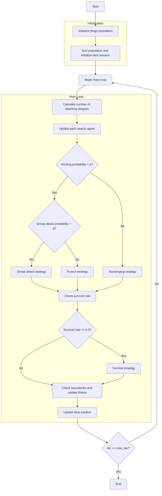

# Dingo Optimizer Algorithm Flowchart



### Detailed Explanation of Steps:

1. **Initialize dingo population**:
   - Randomly generate initial positions within the search space
   - Each position X_i ∈ [lb, ub]^dim
   - Calculate objective function value objective_func(X_i)

2. **Sort population and initialize best solution**:
   - Sort population based on fitness values
   - Select initial best solution

3. **Main loop** (max_iter times):
   - **Calculate number of attacking dingoes**:
     ```python
     na = self._calculate_attacking_dingoes(search_agents_no)
     ```

   - **Update each search agent**:
     * Each dingo updates its position based on hunting strategy

   - **Hunting strategies**:
     * **Group attack**:
       ```python
       sumatory = self._group_attack(population, na, current_idx)
       new_position = beta1 * sumatory - self.best_solver.position
       ```
     * **Pursuit**:
       ```python
       new_position = (self.best_solver.position + 
                      beta1 * np.exp(beta2) * 
                      (population[r1].position - population[current_idx].position))
       ```
     * **Scavenging**:
       ```python
       new_position = (np.exp(beta2) * population[r1].position - 
                      ((-1) ** binary_val) * population[current_idx].position) / 2
       ```

   - **Survival strategy** (if survival rate <= 0.3):
     ```python
     new_position = (self.best_solver.position + 
                    (population[r1].position - 
                     ((-1) ** binary_val) * population[r2].position) / 2)
     ```

   - **Check boundaries and update fitness**:
     * Ensure positions remain within bounds [lb, ub]
     * Recalculate objective function value

   - **Update best solution**:
     * Compare and update if better solution is found

4. **End**:
   - Store final results
   - Display optimization history
   - Return best solution and history