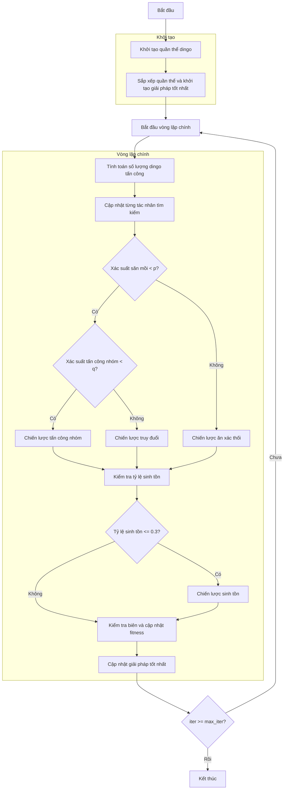

# Sơ đồ thuật toán Dingo Optimizer



### Giải thích chi tiết các bước:

1. **Khởi tạo quần thể dingo**: 
   - Tạo ngẫu nhiên các vị trí ban đầu trong không gian tìm kiếm
   - Mỗi vị trí X_i ∈ [lb, ub]^dim
   - Tính toán giá trị hàm mục tiêu objective_func(X_i)

2. **Sắp xếp quần thể và khởi tạo giải pháp tốt nhất**:
   - Sắp xếp quần thể dựa trên giá trị fitness
   - Chọn giải pháp tốt nhất ban đầu

3. **Vòng lặp chính** (max_iter lần):
   - **Tính toán số lượng dingo tấn công**:
     ```python
     na = self._calculate_attacking_dingoes(search_agents_no)
     ```

   - **Cập nhật từng tác nhân tìm kiếm**:
     * Mỗi dingo cập nhật vị trí dựa trên chiến lược săn mồi

   - **Chiến lược săn mồi**:
     * **Tấn công nhóm** (Group attack):
       ```python
       sumatory = self._group_attack(population, na, current_idx)
       new_position = beta1 * sumatory - self.best_solver.position
       ```
     * **Truy đuổi** (Persecution):
       ```python
       new_position = (self.best_solver.position + 
                      beta1 * np.exp(beta2) * 
                      (population[r1].position - population[current_idx].position))
       ```
     * **Ăn xác thối** (Scavenging):
       ```python
       new_position = (np.exp(beta2) * population[r1].position - 
                      ((-1) ** binary_val) * population[current_idx].position) / 2
       ```

   - **Chiến lược sinh tồn** (nếu tỷ lệ sinh tồn <= 0.3):
     ```python
     new_position = (self.best_solver.position + 
                    (population[r1].position - 
                     ((-1) ** binary_val) * population[r2].position) / 2)
     ```

   - **Kiểm tra biên và cập nhật fitness**:
     * Đảm bảo vị trí nằm trong biên [lb, ub]
     * Tính toán lại giá trị hàm mục tiêu

   - **Cập nhật giải pháp tốt nhất**:
     * So sánh và cập nhật nếu tìm thấy giải pháp tốt hơn

4. **Kết thúc**:
   - Lưu trữ kết quả cuối cùng
   - Hiển thị lịch sử tối ưu hóa
   - Trả về giải pháp tốt nhất và lịch sử
