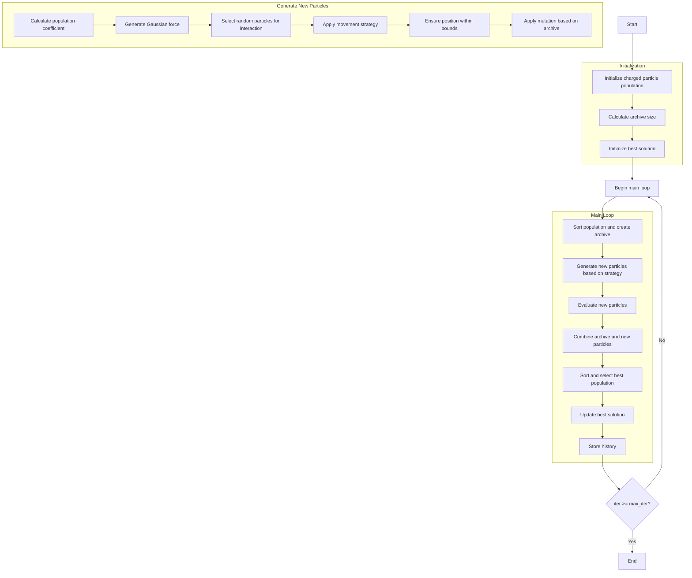

# Electromagnetic Charged Particles Optimizer Algorithm Flowchart



### Detailed Explanation of Steps:

1. **Initialize charged particle population**:
   - Randomly generate initial positions for charged particles
   - Each particle represents a solution in the search space

2. **Calculate archive size**:
   - Calculate archive size based on archive ratio
   ```python
   archive_size = int(search_agents_no / self.archive_ratio)
   ```

3. **Initialize best solution**:
   - Sort population and select initial best solution

4. **Main loop** (max_iter times):
   - **Sort population and create archive**:
     * Sort population by fitness
     * Create archive from best solutions
     ```python
     sorted_population, _ = self._sort_population(population)
     archive = sorted_population[:archive_size]
     ```
   
   - **Generate new particles based on strategy**:
     * **Calculate population coefficient**: Based on selected strategy
     * **Generate Gaussian force**: Random force with mean=0.7, std=0.2
     * **Select random particles for interaction**: Select npi particles from population
     * **Apply movement strategy**: One of three strategies
     * **Ensure position within bounds**: Keep position within [lb, ub] range
     * **Apply mutation based on archive**: Replace values from archive
   
   - **Evaluate new particles**:
     * Calculate objective function values for new particles
   
   - **Combine archive and new particles**:
     * Combine archive and newly created particles into combined population
   
   - **Sort and select best population**:
     * Sort combined population by fitness
     * Select best solutions for next population
     ```python
     sorted_combined, _ = self._sort_population(combined_population)
     population = sorted_combined[:search_agents_no]
     ```
   
   - **Update best solution**:
     * Compare and update if better solution is found
   
   - **Store history**:
     * Save best solution at each iteration

### Details of Movement Strategies:

**Strategy 1: Pairwise Interaction**
- Create new particles from pairwise interactions between particles
- Move toward best solution
- Add interactions with other particles
- Number of new particles: 2 * C(npi, 2)

**Strategy 2: Combined Interaction**
- Create new particles from combined interactions of all particles
- Move toward best solution (without force)
- Add interactions with all other particles
- Number of new particles: npi

**Strategy 3: Hybrid Method**
- Combine both movement types from strategies 1 and 2
- Create particles with full force and without force
- Number of new particles: 2 * C(npi, 2) + npi

5. **End**:
   - Store final results
   - Display optimization history
   - Return best solution