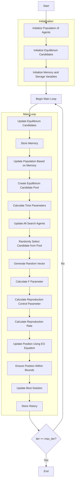

# Equilibrium Optimizer Algorithm Flowchart



### Detailed Explanation of Steps:

1. **Initialize Population of Agents**:
   - Randomly create initial positions for search agents
   - Each agent represents a solution in the search space

2. **Initialize Equilibrium Candidates**:
   - Initialize 4 equilibrium candidates (Ceq1, Ceq2, Ceq3, Ceq4)
   - Initialize initial fitness values for the candidates
   ```python
   Ceq1 = Member(np.zeros(self.dim), np.inf if not self.maximize else -np.inf)
   Ceq2 = Member(np.zeros(self.dim), np.inf if not self.maximize else -np.inf)
   Ceq3 = Member(np.zeros(self.dim), np.inf if not self.maximize else -np.inf)
   Ceq4 = Member(np.zeros(self.dim), np.inf if not self.maximize else -np.inf)
   ```

3. **Initialize Memory and Storage Variables**:
   - Initialize memory for old population and fitness
   - Initialize optimization history
   ```python
   C_old = [member.copy() for member in population]
   fit_old = np.array([member.fitness for member in population])
   ```

4. **Main Loop** (max_iter times):
   - **Update Equilibrium Candidates**:
     * Ensure positions are within bounds
     * Calculate new fitness
     * Update 4 equilibrium candidates based on fitness ranking
     * Best candidate is stored in Ceq1, followed by Ceq2, Ceq3, Ceq4
   
   - **Store Memory**:
     * Store current population state in memory
   
   - **Update Population Based on Memory**:
     * Compare current fitness with fitness in memory
     * Restore position and fitness from memory if better
   
   - **Create Equilibrium Candidate Pool**:
     * Calculate average equilibrium candidate (Ceq_ave)
     * Create pool of 5 candidates: Ceq1, Ceq2, Ceq3, Ceq4, Ceq_ave
     ```python
     Ceq_ave = Member((Ceq1.position + Ceq2.position + Ceq3.position + Ceq4.position) / 4, 0)
     Ceq_pool = [Ceq1, Ceq2, Ceq3, Ceq4, Ceq_ave]
     ```
   
   - **Calculate Time Parameters**:
     * Calculate time parameter that decreases with iterations
     ```python
     t = (1 - iter / max_iter) ** (self.a2 * iter / max_iter)
     ```
   
   - **Update All Search Agents**:
     * Process each agent in the population
   
   - **Randomly Select Candidate from Pool**:
     * Randomly select one candidate from the pool of 5 candidates
     ```python
     Ceq = np.random.choice(Ceq_pool)
     ```
   
   - **Generate Random Vector**:
     * Generate random lambda and r vectors
     ```python
     lambda_vec = np.random.random(self.dim)
     r = np.random.random(self.dim)
     ```
   
   - **Calculate F Parameter**:
     * Calculate F parameter based on physics formula
     ```python
     F = self.a1 * np.sign(r - 0.5) * (np.exp(-lambda_vec * t) - 1)
     ```
   
   - **Calculate Reproduction Control Parameter**:
     * Calculate parameter controlling reproduction process
     ```python
     GCP = 0.5 * r1 * np.ones(self.dim) * (r2 >= self.GP)
     ```
   
   - **Calculate Reproduction Rate**:
     * Calculate reproduction rate G0 and G
     ```python
     G0 = GCP * (Ceq.position - lambda_vec * population[i].position)
     G = G0 * F
     ```
   
   - **Update Position Using EO Equation**:
     * Update position based on equilibrium equation
     ```python
     new_position = Ceq.position + (population[i].position - Ceq.position) * F + (G / (lambda_vec * 1.0)) * (1 - F)
     ```
   
   - **Ensure Position Within Bounds**:
     * Keep positions within [lb, ub] range
   
   - **Update Best Solution**:
     * Compare and update if a better solution is found
   
   - **Store History**:
     * Save the best solution at each iteration

5. **End**:
   - Store final results
   - Display optimization history
   - Return the best solution