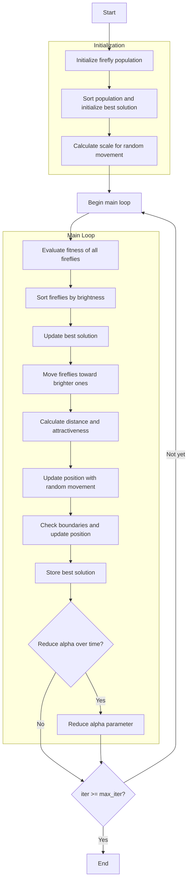

# Firefly Optimizer Algorithm Flowchart



### Detailed Explanation of Steps:

1. **Initialize firefly population**:
   - Randomly generate initial positions within the search space
   - Each position X_i ∈ [lb, ub]^dim
   - Calculate objective function value objective_func(X_i)

2. **Sort population and initialize best solution**:
   - Sort population based on fitness values (brightness)
   - Select initial best solution

3. **Calculate scale for random movement**:
   ```python
   scale = np.abs(self.ub - self.lb)
   ```

4. **Main loop** (max_iter times):
   - **Evaluate fitness of all fireflies**:
     * Recalculate objective function value for each firefly

   - **Sort fireflies by brightness**:
     * Sort population based on fitness to identify brightest fireflies

   - **Update best solution**:
     * Compare and update if better solution is found

   - **Move fireflies toward brighter ones**:
     * Each firefly moves toward fireflies brighter than itself
     ```python
     if self._is_better(population[j], population[i]):
         # Firefly i moves toward firefly j
     ```

   - **Calculate distance and attractiveness**:
     ```python
     r = np.sqrt(np.sum((population[i].position - population[j].position)**2))
     beta = self._calculate_attractiveness(r)
     ```

   - **Update position with random movement**:
     ```python
     random_move = self.alpha * (np.random.random(self.dim) - 0.5) * scale
     new_position = (population[i].position * (1 - beta) + 
                    population[j].position * beta + 
                    random_move)
     ```

   - **Check boundaries and update position**:
     * Ensure position stays within boundaries [lb, ub]
     * Update firefly position

   - **Store best solution**:
     * Save the best solution at each iteration

   - **Reduce alpha parameter** (if enabled):
     ```python
     if self.alpha_reduction:
         self.alpha = self._reduce_alpha(self.alpha, self.alpha_delta)
     ```

5. **End**:
   - Store final results
   - Display optimization history
   - Return best solution and history