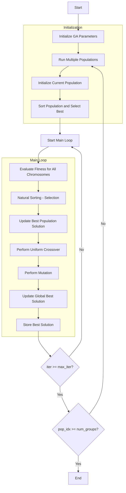

# Genetic Algorithm Optimizer Flowchart



### Detailed Step-by-Step Explanation:

1. **Initialize GA Parameters**:
   - Set up genetic algorithm parameters
   - Number of population groups (num_groups)
   - Crossover rate
   - Mutation rate

2. **Run Multiple Populations**:
   - Run multiple independent populations in parallel
   - Each population has its own set of chromosomes

3. **Initialize Current Population**:
   - Randomly generate initial chromosomes
   ```python
   population = self._init_population(search_agents_no)
   ```

4. **Sort Population and Select Best**:
   - Sort chromosomes by fitness
   - Select the best initial solution for the population

5. **Main Loop** (max_iter times):
   - **Evaluate Fitness for All Chromosomes**:
     * Calculate objective function value for each chromosome
   
   - **Natural Sorting - Selection**:
     * Sort population by fitness
     * Select the best chromosomes
   
   - **Update Best Population Solution**:
     * Compare and update if a better solution is found
   
   - **Perform Uniform Crossover**:
     * Crossover between chromosomes with crossover_rate probability
     * Preserve 2 best chromosomes (elitism)
     ```python
     if np.random.random() < self.crossover_rate:
         # Uniform crossover logic
     ```
   
   - **Perform Mutation**:
     * Mutate worst chromosome with mutation_rate probability
     * Replace with new random solution
     ```python
     if np.random.random() < self.mutation_rate:
         new_population[worst_idx].position = np.random.uniform(self.lb, self.ub, self.dim)
     ```
   
   - **Update Global Best Solution**:
     * Compare between populations to find the best solution
   
   - **Store Best Solution**:
     * Save optimization history

6. **End**:
   - Save final results
   - Display optimization history
   - Return the best solution