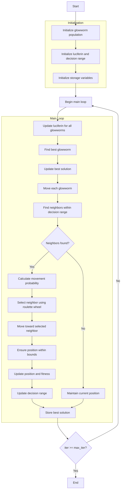

# Glowworm Swarm Optimizer Algorithm Flowchart



### Detailed Step-by-Step Explanation:

1. **Initialize glowworm population**:
   - Randomly generate initial positions for glowworms
   - Each glowworm represents a solution in the search space

2. **Initialize luciferin and decision range**:
   - Initialize initial luciferin values for all glowworms
   - Initialize initial decision range
   ```python
   self.luciferin = np.full(search_agents_no, self.L0)
   self.decision_range = np.full(search_agents_no, self.r0)
   ```

3. **Initialize storage variables**:
   - Initialize optimization history
   - Initialize initial best solution

4. **Main loop** (max_iter times):
   - **Update luciferin for all glowworms**:
     * Collect fitness values of all glowworms
     * Convert fitness to luciferin based on optimization direction
     * Update luciferin with decay and enhancement factors
     ```python
     self.luciferin = (1 - self.rho) * self.luciferin + luciferin_update
     ```
   
   - **Find best glowworm**:
     * Identify glowworm with highest luciferin value
   
   - **Update best solution**:
     * Compare and update if a better solution is found
   
   - **Move each glowworm**:
     * Process each glowworm in the population
   
   - **Find neighbors within decision range**:
     * Find glowworms within the decision range
     * Only consider neighbors with higher luciferin values
     ```python
     neighbors = self._get_neighbors(i, population)
     ```
   
   - **Movement decision**:
     * If neighbors exist:
       * **Calculate movement probability**: Probability proportional to luciferin difference
       * **Select neighbor using roulette wheel**: Random selection based on probability
       * **Move toward selected neighbor**: Move with step size s
       ```python
       new_position = current_pos + self.s * direction_normalized
       ```
       * **Ensure position within bounds**: Keep position within [lb, ub] range
       * **Update position and fitness**: Calculate new objective function value
       * **Update decision range**: Adjust based on number of neighbors
       ```python
       self.decision_range[i] = min(self.rs, max(0, self.decision_range[i] + self.beta * (self.nt - neighbor_count)))
       ```
     * If no neighbors: Maintain current position
   
   - **Store best solution**:
     * Save the best solution at each iteration

5. **End**:
   - Store final results
   - Display optimization history
   - Return the best solution