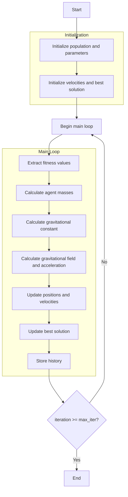

# Gravitational Search Optimizer Algorithm Flowchart



### Detailed Step-by-Step Explanation:

1. **Initialize population and parameters**:
   - Randomly generate initial search agents
   - Set algorithm parameters:
     * Elitist check (elitist_check)
     * Distance exponent parameter (r_power)
     * Initial gravitational constant (g0)
     * Decay parameter (alpha)

2. **Initialize velocities and best solution**:
   - Initialize velocity matrix with zeros
   - Select initial best solution from population
   ```python
   self.velocities = np.zeros((search_agents_no, self.dim))
   best_solver = sorted_population[0].copy()
   ```

3. **Main loop** (max_iter times):
   - **Extract fitness values**:
     * Collect objective function values of all agents
     ```python
     fitness_values = np.array([member.fitness for member in population])
     ```
   
   - **Calculate agent masses**:
     * Calculate masses based on fitness values
     * Normalize masses to sum to 1
     ```python
     masses = self._mass_calculation(fitness_values)
     ```
   
   - **Calculate gravitational constant**:
     * Decreases with iteration count
     ```python
     g = self._gravitational_constant(iteration, max_iter)
     ```
   
   - **Calculate gravitational field and acceleration**:
     * Determine kbest - number of best agents to consider
     * Calculate gravitational forces between agents
     * Calculate acceleration based on gravitational forces
     ```python
     accelerations = self._gravitational_field(population, masses, iteration, max_iter, g)
     ```
   
   - **Update positions and velocities**:
     * Update velocities based on acceleration
     * Update positions based on velocities
     * Ensure positions remain within boundaries
     ```python
     population, self.velocities = self._update_positions(population, accelerations)
     ```
   
   - **Update best solution**:
     * Compare and update if better solution is found
   
   - **Store history**:
     * Save best solution at each iteration

4. **End**:
   - Store final results
   - Display optimization history
   - Return best solution