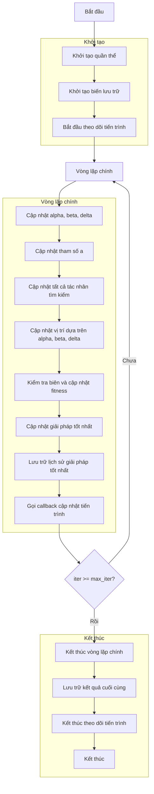

# Sơ đồ thuật toán Grey Wolf Optimizer



## Giải thích chi tiết các bước:

1. **Khởi tạo quần thể**: 
   - Tạo ngẫu nhiên các vị trí ban đầu trong không gian tìm kiếm
   - Mỗi vị trí X_i ∈ [lb, ub]^dim
   - Tính toán giá trị hàm mục tiêu objective_func(X_i)
   ```python
   population = self._init_population(search_agents_no)
   ```

2. **Khởi tạo biến lưu trữ**:
   - Khởi tạo lịch sử tối ưu hóa
   - Khởi tạo giải pháp tốt nhất ban đầu
   ```python
   history_step_solver = []
   best_solver = self.best_solver
   ```

3. **Bắt đầu theo dõi tiến trình**:
   - Hiển thị thanh tiến trình
   - Khởi tạo các callback
   ```python
   self._begin_step_solver(max_iter)
   ```

4. **Vòng lặp chính** (max_iter lần):
   - **Cập nhật alpha, beta, delta**: 
     * Sắp xếp quần thể và chọn 3 giải pháp tốt nhất
     * Alpha: giải pháp tốt nhất (con sói đầu đàn)
     * Beta: giải pháp thứ hai
     * Delta: giải pháp thứ ba
     ```python
     _, idx = self._sort_population(population)
     alpha = population[idx[0]].copy()
     beta = population[idx[1]].copy()
     delta = population[idx[2]].copy()
     ```

   - **Cập nhật tham số a**:
     * Giảm tuyến tính từ 2 về 0 theo số lần lặp
     * Điều khiển hành vi khám phá (a > 1) và khai thác (a < 1)
     ```python
     a = 2 - iter * (2 / max_iter)
     ```

   - **Cập nhật tất cả tác nhân tìm kiếm**:
     * Mỗi tác nhân cập nhật vị trí dựa trên alpha, beta, delta
     * Sử dụng công thức mô phỏng hành vi săn mồi của bầy sói
     ```python
     for i, member in enumerate(population):
         new_position = np.zeros(self.dim)
     ```

   - **Cập nhật vị trí dựa trên alpha, beta, delta**:
     * Tính toán khoảng cách và hướng di chuyển
     * Sử dụng các hệ số ngẫu nhiên A và C
     ```python
     # For alpha wolf
     r1 = np.random.random()
     r2 = np.random.random()
     A1 = 2 * a * r1 - a
     C1 = 2 * r2
     D_alpha = abs(C1 * alpha.position[j] - member.position[j])
     X1 = alpha.position[j] - A1 * D_alpha
     
     # Similar calculations for beta and delta wolves
     new_position[j] = (X1 + X2 + X3) / 3
     ```

   - **Kiểm tra biên và cập nhật fitness**:
     * Đảm bảo vị trí nằm trong biên [lb, ub]
     * Tính toán lại giá trị hàm mục tiêu
     ```python
     new_position = np.clip(new_position, self.lb, self.ub)
     population[i].position = new_position
     population[i].fitness = self.objective_func(new_position)
     ```

   - **Cập nhật giải pháp tốt nhất**:
     * So sánh và cập nhật nếu tìm thấy giải pháp tốt hơn
     ```python
     if self._is_better(population[i], best_solver):
         best_solver = population[i].copy()
     ```

   - **Lưu trữ lịch sử giải pháp tốt nhất**:
     * Ghi lại giải pháp tốt nhất tại mỗi lần lặp
     ```python
     history_step_solver.append(best_solver)
     ```

   - **Gọi callback cập nhật tiến trình**:
     * Cập nhật thanh tiến trình
     * Hiển thị thông tin tối ưu hóa
     ```python
     self._callbacks(iter, max_iter, best_solver)
     ```

5. **Kết thúc**:
   - Lưu trữ kết quả cuối cùng
   - Đóng thanh tiến trình
   - Hiển thị lịch sử tối ưu hóa
   - Trả về giải pháp tốt nhất và lịch sử
   ```python
   self.history_step_solver = history_step_solver
   self.best_solver = best_solver
   self._end_step_solver()
   return history_step_solver, best_solver
   ```

## Nguyên lý hoạt động:
Thuật toán Grey Wolf Optimizer mô phỏng hành vi săn mồi và cấu trúc xã hội của bầy sói xám. Các con sói được phân cấp thành alpha (lãnh đạo), beta (trợ lý), delta (thành viên cấp thấp) và omega (thành viên thường). Trong quá trình tối ưu hóa, các tác nhân tìm kiếm (sói) cập nhật vị trí của chúng dựa trên vị trí của alpha, beta và delta, mô phỏng cách bầy sói hợp tác để bao vây và tấn công con mồi.
