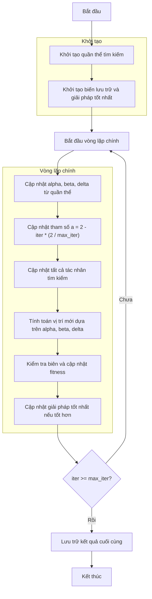

# Sơ đồ thuật toán Grey Wolf Optimizer



### Giải thích chi tiết các bước:

1. **Khởi tạo quần thể tìm kiếm**:
   - Tạo ngẫu nhiên các vị trí ban đầu trong không gian tìm kiếm
   - Mỗi vị trí X_i ∈ [lb, ub]^dim
   - Tính toán giá trị hàm mục tiêu objective_func(X_i)

2. **Khởi tạo biến lưu trữ và giải pháp tốt nhất**:
   - Khởi tạo lịch sử tối ưu hóa history_step_solver
   - Khởi tạo giải pháp tốt nhất ban đầu best_solver

3. **Vòng lặp chính** (max_iter lần):
   - **Cập nhật alpha, beta, delta**:
     * Sắp xếp quần thể và chọn 3 giải pháp tốt nhất
     * Alpha: giải pháp tốt nhất
     * Beta: giải pháp thứ hai
     * Delta: giải pháp thứ ba

   - **Cập nhật tham số a**:
     * Giảm tuyến tính từ 2 về 0 theo số lần lặp
     ```python
     a = 2 - iter * (2 / max_iter)
     ```

   - **Cập nhật tất cả tác nhân tìm kiếm**:
     * Mỗi tác nhân cập nhật vị trí dựa trên alpha, beta, delta
     * Tính toán các vector A và C ngẫu nhiên
     ```python
     A = 2 * a * r1 - a
     C = 2 * r2
     D_alpha = abs(C * alpha.position[j] - member.position[j])
     X1 = alpha.position[j] - A * D_alpha
     ```

   - **Tính toán vị trí mới**:
     * Kết hợp đóng góp từ alpha, beta, delta
     ```python
     new_position[j] = (X1 + X2 + X3) / 3
     ```

   - **Kiểm tra biên và cập nhật fitness**:
     * Đảm bảo vị trí nằm trong biên [lb, ub]
     * Tính toán lại giá trị hàm mục tiêu

   - **Cập nhật giải pháp tốt nhất**:
     * So sánh và cập nhật nếu tìm thấy giải pháp tốt hơn

4. **Kết thúc**:
   - Lưu trữ kết quả cuối cùng
   - Hiển thị lịch sử tối ưu hóa
   - Trả về giải pháp tốt nhất và lịch sử
