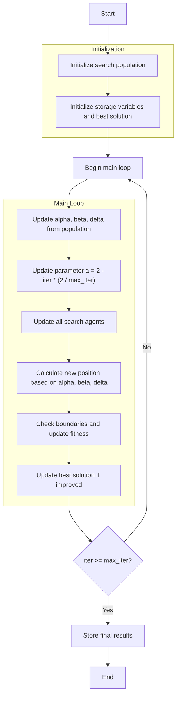

# Grey Wolf Optimizer Algorithm Flowchart



### Detailed Step-by-Step Explanation:

1. **Initialize search population**:
   - Randomly generate initial positions within the search space
   - Each position X_i ∈ [lb, ub]^dim
   - Calculate objective function value objective_func(X_i)

2. **Initialize storage variables and best solution**:
   - Initialize optimization history history_step_solver
   - Initialize initial best solution best_solver

3. **Main loop** (max_iter times):
   - **Update alpha, beta, delta**:
     * Sort population and select 3 best solutions
     * Alpha: best solution
     * Beta: second best solution
     * Delta: third best solution

   - **Update parameter a**:
     * Linearly decreases from 2 to 0 based on iteration count
     ```python
     a = 2 - iter * (2 / max_iter)
     ```

   - **Update all search agents**:
     * Each agent updates position based on alpha, beta, delta
     * Calculate random A and C vectors
     ```python
     A = 2 * a * r1 - a
     C = 2 * r2
     D_alpha = abs(C * alpha.position[j] - member.position[j])
     X1 = alpha.position[j] - A * D_alpha
     ```

   - **Calculate new position**:
     * Combine contributions from alpha, beta, delta
     ```python
     new_position[j] = (X1 + X2 + X3) / 3
     ```

   - **Check boundaries and update fitness**:
     * Ensure position stays within boundaries [lb, ub]
     * Recalculate objective function value

   - **Update best solution**:
     * Compare and update if better solution is found

4. **Termination**:
   - Store final results
   - Display optimization history
   - Return best solution and history