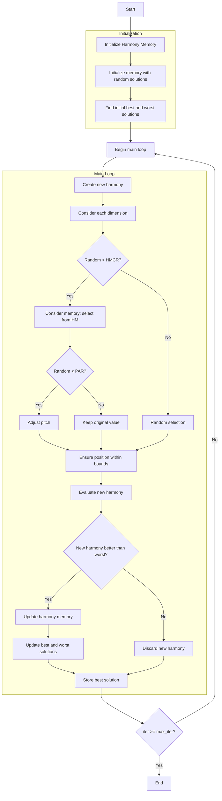

# Harmony Search Optimizer Algorithm Flowchart



### Detailed Explanation of Steps:

1. **Initialize Harmony Memory**:
   - Initialize the Harmony Memory matrix
   - Initialize fitness array for the memory
   ```python
   self.harmony_memory = np.zeros((self.hms, self.dim))
   self.harmony_fitness = np.zeros(self.hms)
   ```

2. **Initialize memory with random solutions**:
   - Randomly generate initial harmonies
   - Calculate fitness value for each harmony
   ```python
   self.harmony_memory[i] = np.random.uniform(self.lb, self.ub, self.dim)
   self.harmony_fitness[i] = self.objective_func(self.harmony_memory[i])
   ```

3. **Find initial best and worst solutions**:
   - Identify indices of the best and worst harmonies
   - Store the initial best solution

4. **Main loop** (max_iter times):
   - **Create new harmony**:
     * Initialize new harmony with zero values
   
   - **Consider each dimension**:
     * Process each dimension of the search space
   
   - **Decision to consider memory or random selection**:
     * If random number < HMCR (Harmony Memory Considering Rate):
       * **Consider memory**: Select value from harmony memory
       ```python
       harmony_idx = np.random.randint(0, self.hms)
       new_harmony[j] = self.harmony_memory[harmony_idx, j]
       ```
       * If random number < PAR (Pitch Adjustment Rate):
         * **Adjust pitch**: Add noise with bandwidth
         ```python
         new_harmony[j] += self.bw * (2 * np.random.random() - 1)
         ```
     * Otherwise:
       * **Random selection**: Select random value within bounds
   
   - **Ensure position within bounds**:
     * Keep values within the [lb, ub] range
   
   - **Evaluate new harmony**:
     * Calculate objective function value for the new harmony
   
   - **Decision to update memory**:
     * If new harmony is better than the worst harmony in memory:
       * **Update harmony memory**: Replace the worst harmony
       * **Update best and worst solutions**: Re-find the indices
       ```python
       self.harmony_memory[worst_idx_current] = new_harmony
       self.harmony_fitness[worst_idx_current] = new_fitness
       ```
     * Otherwise: Discard the new harmony
   
   - **Store best solution**:
     * Save the best solution at each iteration

5. **End**:
   - Store final results
   - Display optimization history
   - Return the best solution