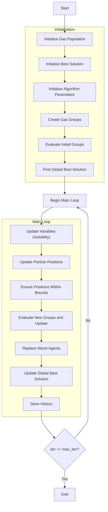

# Flowchart of the Henry Gas Solubility Optimizer Algorithm



### Detailed Explanation of Steps:

1. **Initialize Gas Population**:
   - Randomly generate initial positions for gas particles
   - Each gas particle represents a solution in the search space

2. **Initialize Best Solution**:
   - Sort the population and select the initial best solution

3. **Initialize Algorithm Parameters**:
   - Randomly initialize Henry's constant (K)
   - Randomly initialize partial pressure (P)
   - Randomly initialize constant (C)
   ```python
   K = self.l1 * np.random.rand(self.n_types)
   P = self.l2 * np.random.rand(search_agents_no)
   C = self.l3 * np.random.rand(self.n_types)
   ```

4. **Create Gas Groups**:
   - Divide the population into groups based on the number of gas types
   - Each group has an equal number of particles
   ```python
   groups = self._create_groups(population)
   ```

5. **Evaluate Initial Groups**:
   - Calculate fitness values for each particle in the group
   - Find the best solution for each group
   ```python
   groups[i], group_best_fitness[i], group_best_positions[i] = self._evaluate_group(groups[i], None, True)
   ```

6. **Find Global Best Solution**:
   - Compare the best solutions from each group
   - Select the global best solution

7. **Main Loop** (max_iter times):
   - **Update Variables (Solubility)**:
     * Calculate temperature based on iteration count
     * Update Henry's constant based on temperature
     * Calculate solubility for each group
     ```python
     S = self._update_variables(search_agents_no, iter, max_iter, K, P, C)
     ```
   
   - **Update Particle Positions**:
     * Calculate gamma parameter based on fitness
     * Randomly select movement direction (1 or -1)
     * Update positions based on influence from group best and global best
     ```python
     new_position[k] += group_best_influence + global_best_influence
     ```
   
   - **Ensure Positions Within Bounds**:
     * Keep positions within the [lb, ub] range
   
   - **Evaluate New Groups and Update**:
     * Calculate fitness values for new particles
     * Update if better solutions are found
   
   - **Replace Worst Agents**:
     * Calculate the number of worst agents to replace
     * Replace with new random positions
     ```python
     groups[i] = self._worst_agents(groups[i])
     ```
   
   - **Update Global Best Solution**:
     * Compare and update if a better solution is found
   
   - **Store History**:
     * Save the best solution at each iteration

### Solubility Update Details:

**Temperature Formula**:
```python
T = np.exp(-iter / max_iter)  # Decreases with iteration count
```

**Update Henry's Constant**:
```python
K[j] = K[j] * np.exp(-C[j] * (1/T - 1/T0))  # T0 = 298.15
```

**Calculate Solubility**:
```python
S[start_idx:end_idx] = P[start_idx:end_idx] * K[j]
```

### Position Update Details:

**Gamma Parameter**:
```python
gamma = self.beta * np.exp(-(global_best_fitness + 0.05) / (current_fitness + 0.05))
```

**Group Best Influence**:
```python
group_best_influence = direction_flag * np.random.random() * gamma * (group_best_positions[i][k] - groups[i][j].position[k])
```

**Global Best Influence**:
```python
global_best_influence = np.random.random() * self.alpha * direction_flag * (S[i * group_size + j] * global_best_position[k] - groups[i][j].position[k])
```

8. **End**:
   - Store final results
   - Display optimization history
   - Return the best solution