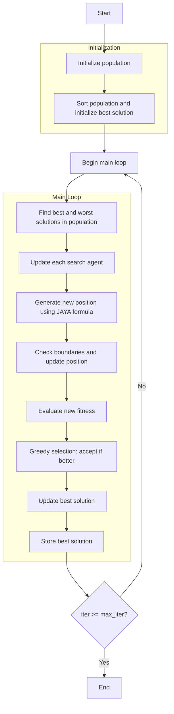

# JAYA Optimizer Algorithm Flowchart



### Detailed Step-by-Step Explanation:

1. **Initialize population**:
   - Randomly generate initial positions within the search space
   - Each position X_i ∈ [lb, ub]^dim
   - Calculate objective function values objective_func(X_i)

2. **Sort population and initialize best solution**:
   - Sort population based on fitness values
   - Select initial best solution

3. **Main loop** (max_iter times):
   - **Find best and worst solutions in population**:
     * Identify the best solution (best_member) and worst solution (worst_member) in current population

   - **Update each search agent**:
     * Each agent updates its position using JAYA formula

   - **Generate new position using JAYA formula**:
     ```python
     new_position[j] = (
         population[i].position[j] + 
         rand1 * (best_member.position[j] - abs(population[i].position[j])) - 
         rand2 * (worst_member.position[j] - abs(population[i].position[j]))
     )
     ```
     * This formula helps agents move toward the best solution and away from the worst solution

   - **Check boundaries and update position**:
     * Ensure positions remain within bounds [lb, ub]
     ```python
     new_position = np.clip(new_position, self.lb, self.ub)
     ```

   - **Evaluate new fitness**:
     * Calculate objective function value for new position
     ```python
     new_fitness = self.objective_func(new_position)
     ```

   - **Greedy selection: accept if better**:
     * Only accept new position if it's better than current position
     ```python
     if self._is_better(Member(new_position, new_fitness), population[i]):
         population[i].position = new_position
         population[i].fitness = new_fitness
     ```

   - **Update best solution**:
     * Compare and update if better solution is found

   - **Store best solution**:
     * Save the best solution at each iteration

4. **End**:
   - Store final results
   - Display optimization history
   - Return best solution and history