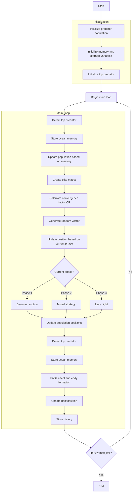

# Marine Predators Optimizer Algorithm Flowchart



### Detailed Explanation of Steps:

1. **Initialize predator population**:
   - Randomly generate initial positions for prey and predators
   - Each individual represents a solution in the search space

2. **Initialize memory and storage variables**:
   - Initialize memory for old population and fitness
   - Initialize optimization history
   ```python
   Prey_old = [member.copy() for member in population]
   fit_old = np.array([member.fitness for member in population])
   ```

3. **Initialize top predator**:
   - Initialize position and fitness for the best predator
   - Set boundary matrix for FADs effect
   ```python
   Top_predator_pos = np.zeros(self.dim)
   Top_predator_fit = np.inf if not self.maximize else -np.inf
   ```

4. **Main loop** (max_iter times):
   - **Detect top predator**:
     * Ensure positions are within boundaries
     * Calculate new fitness
     * Update top predator if a better solution is found
   
   - **Store ocean memory**:
     * Save current population state to memory
   
   - **Update population based on memory**:
     * Compare current fitness with fitness in memory
     * Update positions and fitness based on comparison results
     ```python
     new_positions = np.where(Indx, old_positions, positions)
     new_fitness = np.where(Inx, fit_old, current_fitness)
     ```
   
   - **Create elite matrix**:
     * Create matrix containing repeated top predators
     ```python
     Elite = np.tile(Top_predator_pos, (search_agents_no, 1))
     ```
   
   - **Calculate convergence factor CF**:
     * Calculate decreasing convergence factor based on iteration count
     ```python
     CF = (1 - iter / max_iter) ** (2 * iter / max_iter)
     ```
   
   - **Generate random vector**:
     * Create Levy flight and Brownian motion vectors
     ```python
     RL = 0.05 * self._levy_flight(search_agents_no, self.dim, 1.5)
     RB = np.random.randn(search_agents_no, self.dim)
     ```
   
   - **Update position based on current phase**:
     * **Phase 1 (Iter < Max_iter/3)**: Brownian motion - High speed
       ```python
       stepsize = RB[i, j] * (Elite[i, j] - RB[i, j] * positions[i, j])
       positions[i, j] = positions[i, j] + self.P * R * stepsize
       ```
     * **Phase 2 (Max_iter/3 < Iter < 2*Max_iter/3)**: Mixed strategy - Unit speed
       * Upper half: Brownian motion
       * Lower half: Levy flight
     * **Phase 3 (Iter > 2*Max_iter/3)**: Levy flight - Low speed
       ```python
       stepsize = RL[i, j] * (RL[i, j] * Elite[i, j] - positions[i, j])
       positions[i, j] = Elite[i, j] + self.P * CF * stepsize
       ```
   
   - **FADs effect and eddy formation**:
     * With FADs probability: Fish Aggregating Devices effect
       ```python
       U = np.random.rand(search_agents_no, self.dim) < self.FADs
       random_positions = Xmin + np.random.rand(search_agents_no, self.dim) * (Xmax - Xmin)
       positions = positions + CF * random_positions * U
       ```
     * Otherwise: Eddy formation effect
       ```python
       stepsize = (self.FADs * (1 - r) + r) * (positions[idx1] - positions[idx2])
       positions = positions + stepsize
       ```
   
   - **Update best solution**:
     * Compare and update if a better solution is found
   
   - **Store history**:
     * Save the best solution at each iteration

5. **End**:
   - Store final results
   - Display optimization history
   - Return the best solution