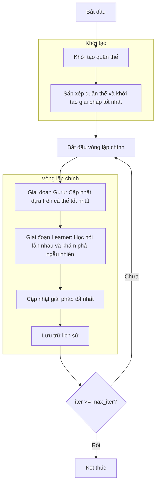

# Sơ đồ thuật toán Modified Social Group Optimizer



## Giải thích chi tiết các bước:

### 1. Khởi tạo quần thể:
- Tạo ngẫu nhiên các vị trí ban đầu trong không gian tìm kiếm
- Mỗi vị trí X_i ∈ [lb, ub]^dim
- Tính toán giá trị hàm mục tiêu objective_func(X_i)
- Kích thước quần thể: search_agents_no

```python
# Khởi tạo quần thể:
population = []
for _ in range(search_agents_no):
    position = np.random.uniform(self.lb, self.ub, self.dim)
    fitness = self.objective_func(position)
    population.append(Member(position, fitness))
```

### 2. Sắp xếp quần thể và khởi tạo giải pháp tốt nhất:
- Sắp xếp quần thể theo giá trị fitness (tốt nhất đầu tiên)
- Lưu trữ giải pháp tốt nhất ban đầu
- Khởi tạo lịch sử tối ưu hóa

```python
# Sắp xếp và lấy giải pháp tốt nhất:
sorted_population, _ = self._sort_population(population)
best_solution = sorted_population[0].copy()
history_step_solver = []
```

### 3. Vòng lặp chính (max_iter lần):
#### Giai đoạn Guru: Cập nhật dựa trên cá thể tốt nhất
- Xác định guru (cá thể tốt nhất hiện tại)
- Mỗi cá thể cập nhật vị trí: c*current + rand*(guru - current)
- Áp dụng chọn lọc tham lam: chỉ chấp nhận nếu tốt hơn

```python
# Cập nhật vị trí trong giai đoạn Guru:
new_position[j] = (self.c * population[i].position[j] + 
                  np.random.random() * (guru.position[j] - population[i].position[j]))
```

#### Giai đoạn Learner: Học hỏi lẫn nhau và khám phá ngẫu nhiên
- Chọn ngẫu nhiên một đối tác khác với cá thể hiện tại
- So sánh fitness với đối tác:
  - Nếu tốt hơn: có xác suất sap thực hiện khám phá ngẫu nhiên
  - Nếu kém hơn: học từ đối tác và giải pháp toàn cục
- Công thức học hỏi: current + rand*(current - partner) + rand*(global_best - current)
- Áp dụng chọn lọc tham lam

```python
# Chiến lược học hỏi:
if tốt hơn đối tác và không khám phá ngẫu nhiên:
    new_position[j] = current + rand*(current - partner) + rand*(global_best - current)
elif tốt hơn đối tác và khám phá ngẫu nhiên:
    new_position = np.random.uniform(self.lb, self.ub, self.dim)
else:  # kém hơn đối tác
    new_position[j] = current + rand*(partner - current) + rand*(global_best - current)
```

### 4. Cập nhật giải pháp tốt nhất:
- Sau mỗi vòng lặp, sắp xếp lại quần thể
- So sánh giải pháp tốt nhất hiện tại với giải pháp toàn cục
- Cập nhật nếu tìm thấy giải pháp tốt hơn

```python
# Cập nhật giải pháp tốt nhất:
sorted_population, _ = self._sort_population(population)
current_best = sorted_population[0]
if self._is_better(current_best, best_solution):
    best_solution = current_best.copy()
```

### 5. Lưu trữ lịch sử:
- Lưu trữ giải pháp tốt nhất của mỗi vòng lặp
- Theo dõi tiến trình tối ưu hóa

```python
# Lưu trữ lịch sử:
history_step_solver.append(best_solution.copy())
```

### 6. Kết thúc:
- Lưu trữ kết quả cuối cùng
- Hiển thị lịch sử tối ưu hóa
- Trả về giải pháp tốt nhất và lịch sử

```python
# Kết thúc thuật toán:
self.history_step_solver = history_step_solver
self.best_solver = best_solution
return history_step_solver, best_solution
```

## Tham số thuật toán:
- **c**: Hệ số học tập cho giai đoạn Guru (mặc định: 0.2)
- **sap**: Xác suất tự thích ứng cho khám phá ngẫu nhiên (mặc định: 0.7)
- **search_agents_no**: Số lượng cá thể tìm kiếm
- **max_iter**: Số vòng lặp tối đa

## Đặc điểm thuật toán:
- Kết hợp học hỏi từ cá thể tốt nhất (Guru phase)
- Học hỏi lẫn nhau giữa các cá thể (Learner phase)  
- Có cơ chế khám phá ngẫu nhiên để tránh cực trị địa phương
- Sử dụng chọn lọc tham lam để duy trì giải pháp tốt
