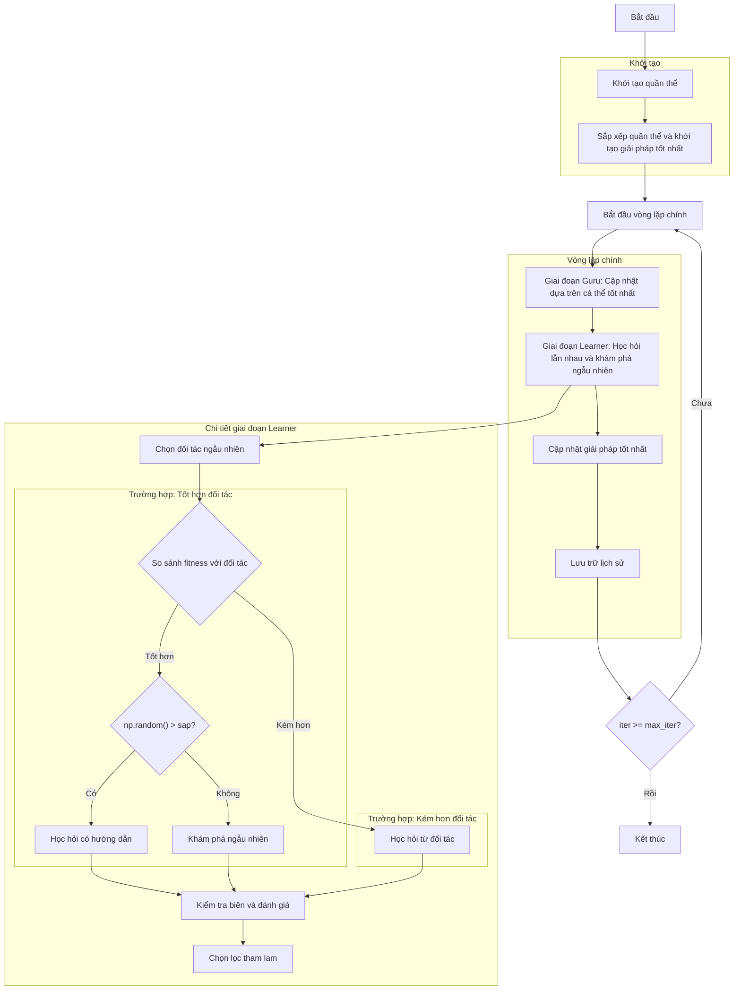

# Sơ đồ thuật toán Modified Social Group Optimizer



## Giải thích chi tiết các bước:

### 1. Khởi tạo quần thể:
- Tạo ngẫu nhiên các vị trí ban đầu trong không gian tìm kiếm
- Mỗi vị trí X_i ∈ [lb, ub]^dim
- Tính toán giá trị hàm mục tiêu objective_func(X_i)
- Kích thước quần thể: search_agents_no

```python
# Khởi tạo quần thể:
population = []
for _ in range(search_agents_no):
    position = np.random.uniform(self.lb, self.ub, self.dim)
    fitness = self.objective_func(position)
    population.append(Member(position, fitness))
```

### 2. Sắp xếp quần thể và khởi tạo giải pháp tốt nhất:
- Sắp xếp quần thể theo giá trị fitness (tốt nhất đầu tiên)
- Lưu trữ giải pháp tốt nhất ban đầu
- Khởi tạo lịch sử tối ưu hóa

```python
# Sắp xếp và lấy giải pháp tốt nhất:
sorted_population, _ = self._sort_population(population)
best_solution = sorted_population[0].copy()
history_step_solver = []
```

### 3. Vòng lặp chính (max_iter lần):
#### Giai đoạn Guru: Cập nhật dựa trên cá thể tốt nhất
- Xác định guru (cá thể tốt nhất hiện tại)
- Mỗi cá thể cập nhật vị trí: c*current + rand*(guru - current)
- Áp dụng chọn lọc tham lam: chỉ chấp nhận nếu tốt hơn

```python
# Cập nhật vị trí trong giai đoạn Guru:
new_position[j] = (self.c * population[i].position[j] + 
                  np.random.random() * (guru.position[j] - population[i].position[j]))
```

#### Giai đoạn Learner: Học hỏi lẫn nhau và khám phá ngẫu nhiên
- **Bước 1: Chọn đối tác ngẫu nhiên**
  - Chọn ngẫu nhiên một cá thể khác trong quần thể làm đối tác
  - Đảm bảo đối tác khác với cá thể hiện tại

- **Bước 2: So sánh fitness và quyết định chiến lược**
  ```python
  # So sánh fitness với đối tác:
  is_better = (population[i].fitness < population[r1].fitness if not self.maximize 
               else population[i].fitness > population[r1].fitness)
  
  if is_better:
      # Cá thể hiện tại tốt hơn đối tác
      if np.random.random() > self.sap:
          # Chiến lược 1: Học hỏi có hướng dẫn
          # current + rand*(current - partner) + rand*(global_best - current)
          # Tăng cường vị trí hiện tại, giảm ảnh hưởng của đối tác kém hơn
          # và học từ giải pháp toàn cục tốt nhất
      else:
          # Chiến lược 2: Khám phá ngẫu nhiên
          # Tạo vị trí hoàn toàn mới trong không gian tìm kiếm
          # Giúp thoát khỏi cực trị địa phương
  else:
      # Cá thể hiện tại kém hơn đối tác
      # Chiến lược 3: Học hỏi từ đối tác tốt hơn
      # current + rand*(partner - current) + rand*(global_best - current)
      # Học từ đối tác tốt hơn và giải pháp toàn cục
  ```

- **Bước 3: Cập nhật vị trí chi tiết**
  ```python
  # Chiến lược 1: Học hỏi có hướng dẫn (khi tốt hơn và không khám phá)
  new_position[j] = (population[i].position[j] + 
                    np.random.random() * (population[i].position[j] - population[r1].position[j]) +
                    np.random.random() * (global_best.position[j] - population[i].position[j]))
  
  # Chiến lược 2: Khám phá ngẫu nhiên (khi tốt hơn và có khám phá)
  new_position = np.random.uniform(self.lb, self.ub, self.dim)
  
  # Chiến lược 3: Học hỏi từ đối tác (khi kém hơn)
  new_position[j] = (population[i].position[j] + 
                    np.random.random() * (population[r1].position[j] - population[i].position[j]) +
                    np.random.random() * (global_best.position[j] - population[i].position[j]))
  ```

- **Bước 4: Kiểm tra biên và đánh giá**
  - Đảm bảo vị trí mới nằm trong biên [lb, ub]
  - Tính toán giá trị fitness mới

- **Bước 5: Chọn lọc tham lam**
  - Chỉ chấp nhận vị trí mới nếu tốt hơn vị trí cũ
  - Duy trì giải pháp tốt trong quần thể

**Giải thích các chiến lược:**
1. **Học hỏi có hướng dẫn**: Khi cá thể tốt hơn đối tác và không khám phá ngẫu nhiên, nó củng cố vị trí hiện tại bằng cách giảm ảnh hưởng của đối tác kém hơn và học từ giải pháp toàn cục.

2. **Khám phá ngẫu nhiên**: Khi cá thể tốt hơn đối tác và có khám phá ngẫu nhiên (với xác suất sap), nó tạo vị trí hoàn toàn mới để khám phá các vùng không gian mới, giúp tránh cực trị địa phương.

3. **Học hỏi từ đối tác**: Khi cá thể kém hơn đối tác, nó học từ đối tác tốt hơn và giải pháp toàn cục để cải thiện vị trí của mình.

**Tham số điều khiển:**
- **sap (Self-adaptive probability)**: Xác suất khám phá ngẫu nhiên (mặc định: 0.7)
  - Giá trị cao: Tăng khả năng khám phá, giảm khai thác
  - Giá trị thấp: Tăng khả năng khai thác, giảm khám phá

### 4. Cập nhật giải pháp tốt nhất:
- Sau mỗi vòng lặp, sắp xếp lại quần thể
- So sánh giải pháp tốt nhất hiện tại với giải pháp toàn cục
- Cập nhật nếu tìm thấy giải pháp tốt hơn

```python
# Cập nhật giải pháp tốt nhất:
sorted_population, _ = self._sort_population(population)
current_best = sorted_population[0]
if self._is_better(current_best, best_solution):
    best_solution = current_best.copy()
```

### 5. Lưu trữ lịch sử:
- Lưu trữ giải pháp tốt nhất của mỗi vòng lặp
- Theo dõi tiến trình tối ưu hóa

```python
# Lưu trữ lịch sử:
history_step_solver.append(best_solution.copy())
```

### 6. Kết thúc:
- Lưu trữ kết quả cuối cùng
- Hiển thị lịch sử tối ưu hóa
- Trả về giải pháp tốt nhất và lịch sử

```python
# Kết thúc thuật toán:
self.history_step_solver = history_step_solver
self.best_solver = best_solution
return history_step_solver, best_solution
```

## Tham số thuật toán:
- **c**: Hệ số học tập cho giai đoạn Guru (mặc định: 0.2)
- **sap**: Xác suất tự thích ứng cho khám phá ngẫu nhiên (mặc định: 0.7)
- **search_agents_no**: Số lượng cá thể tìm kiếm
- **max_iter**: Số vòng lặp tối đa

## Đặc điểm thuật toán:
- Kết hợp học hỏi từ cá thể tốt nhất (Guru phase)
- Học hỏi lẫn nhau giữa các cá thể (Learner phase)  
- Có cơ chế khám phá ngẫu nhiên để tránh cực trị địa phương
- Sử dụng chọn lọc tham lam để duy trì giải pháp tốt
