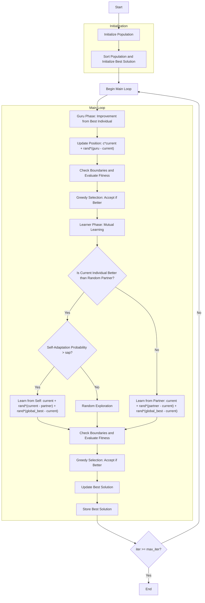

# Modified Social Group Optimizer Algorithm Flowchart



### Detailed Step-by-Step Explanation:

1. **Initialize Population**: 
   - Randomly generate initial positions within the search space
   - Each position X_i ∈ [lb, ub]^dim
   - Calculate objective function value objective_func(X_i)

2. **Sort Population and Initialize Best Solution**:
   - Sort population based on fitness values
   - Select initial best solution

3. **Main Loop** (max_iter times):
   - **Guru Phase: Improvement from Best Individual**:
     * Identify guru (best individual in population)
     * Each individual learns from the guru

   - **Position Update in Guru Phase**:
     ```python
     new_position[j] = (self.c * population[i].position[j] + 
                       np.random.random() * (guru.position[j] - population[i].position[j]))
     ```

   - **Check Boundaries and Evaluate Fitness**:
     * Ensure positions remain within bounds [lb, ub]
     * Calculate objective function value for new position

   - **Greedy Selection: Accept if Better**:
     * Only accept new position if it improves current position

   - **Learner Phase: Mutual Learning**:
     * Each individual selects a random partner to learn from

   - **Learning Strategy Decision**:
     * **If individual is better than partner**:
       - With probability (1 - sap): Learn from self and global best
         ```python
         new_position[j] = (population[i].position[j] + 
                           np.random.random() * (population[i].position[j] - population[r1].position[j]) +
                           np.random.random() * (global_best.position[j] - population[i].position[j]))
         ```
       - With probability sap: Random exploration
         ```python
         new_position = np.random.uniform(self.lb, self.ub, self.dim)
         ```
     * **If individual is worse than partner**:
       - Learn from partner and global best
         ```python
         new_position[j] = (population[i].position[j] + 
                           np.random.random() * (population[r1].position[j] - population[i].position[j]) +
                           np.random.random() * (global_best.position[j] - population[i].position[j]))
         ```

   - **Update Best Solution**:
     * Compare and update if better solution is found

   - **Store Best Solution**:
     * Record best solution at each iteration

4. **Termination**:
   - Save final results
   - Display optimization history
   - Return best solution and history