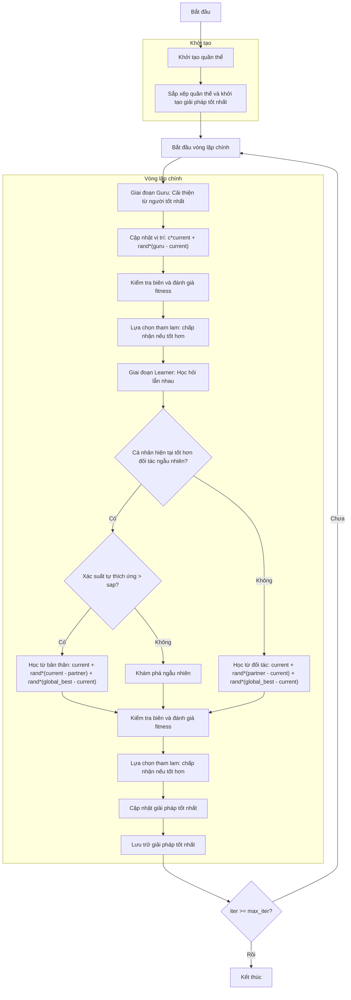

# Sơ đồ thuật toán Modified Social Group Optimizer



### Giải thích chi tiết các bước:

1. **Khởi tạo quần thể**: 
   - Tạo ngẫu nhiên các vị trí ban đầu trong không gian tìm kiếm
   - Mỗi vị trí X_i ∈ [lb, ub]^dim
   - Tính toán giá trị hàm mục tiêu objective_func(X_i)

2. **Sắp xếp quần thể và khởi tạo giải pháp tốt nhất**:
   - Sắp xếp quần thể dựa trên giá trị fitness
   - Chọn giải pháp tốt nhất ban đầu

3. **Vòng lặp chính** (max_iter lần):
   - **Giai đoạn Guru: Cải thiện từ người tốt nhất**:
     * Xác định guru (người tốt nhất trong quần thể)
     * Mỗi cá nhân học hỏi từ guru

   - **Cập nhật vị trí trong giai đoạn Guru**:
     ```python
     new_position[j] = (self.c * population[i].position[j] + 
                       np.random.random() * (guru.position[j] - population[i].position[j]))
     ```

   - **Kiểm tra biên và đánh giá fitness**:
     * Đảm bảo vị trí nằm trong biên [lb, ub]
     * Tính toán giá trị hàm mục tiêu cho vị trí mới

   - **Lựa chọn tham lam: chấp nhận nếu tốt hơn**:
     * Chỉ chấp nhận vị trí mới nếu nó tốt hơn vị trí hiện tại

   - **Giai đoạn Learner: Học hỏi lẫn nhau**:
     * Mỗi cá nhân chọn một đối tác ngẫu nhiên để học hỏi

   - **Quyết định chiến lược học tập**:
     * **Nếu cá nhân tốt hơn đối tác**:
       - Với xác suất (1 - sap): Học từ bản thân và global best
         ```python
         new_position[j] = (population[i].position[j] + 
                           np.random.random() * (population[i].position[j] - population[r1].position[j]) +
                           np.random.random() * (global_best.position[j] - population[i].position[j]))
         ```
       - Với xác suất sap: Khám phá ngẫu nhiên
         ```python
         new_position = np.random.uniform(self.lb, self.ub, self.dim)
         ```
     * **Nếu cá nhân kém hơn đối tác**:
       - Học từ đối tác và global best
         ```python
         new_position[j] = (population[i].position[j] + 
                           np.random.random() * (population[r1].position[j] - population[i].position[j]) +
                           np.random.random() * (global_best.position[j] - population[i].position[j]))
         ```

   - **Cập nhật giải pháp tốt nhất**:
     * So sánh và cập nhật nếu tìm thấy giải pháp tốt hơn

   - **Lưu trữ giải pháp tốt nhất**:
     * Lưu lại giải pháp tốt nhất tại mỗi iteration

4. **Kết thúc**:
   - Lưu trữ kết quả cuối cùng
   - Hiển thị lịch sử tối ưu hóa
   - Trả về giải pháp tốt nhất và lịch sử
