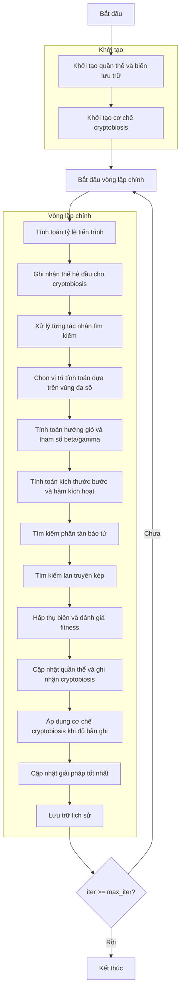

# Sơ đồ thuật toán Moss Growth Optimizer



## Giải thích chi tiết các bước:

### 1. Khởi tạo quần thể và biến lưu trữ:
- Tạo ngẫu nhiên các vị trí ban đầu trong không gian tìm kiếm
- Mỗi vị trí X_i ∈ [lb, ub]^dim
- Tính toán giá trị hàm mục tiêu objective_func(X_i)
- Khởi tạo lịch sử tối ưu hóa và giải pháp tốt nhất

```python
# Khởi tạo quần thể:
population = self._init_population(search_agents_no)
sorted_population, _ = self._sort_population(population)
best_solution = sorted_population[0].copy()
history_step_solver = []
```

### 2. Khởi tạo cơ chế cryptobiosis:
- Khởi tạo mảng lưu trữ lịch sử vị trí và giá trị fitness
- Thiết lập bộ đếm bản ghi
- Cơ chế cryptobiosis giúp lưu trữ và khôi phục trạng thái tốt nhất

```python
# Khởi tạo cryptobiosis:
rM = np.zeros((search_agents_no, self.dim, self.rec_num))
rM_cos = np.zeros((search_agents_no, self.rec_num))
rec = 0
```

### 3. Vòng lặp chính (max_iter lần):
#### Tính toán tỷ lệ tiến trình:
- Tính toán số lần đánh giá hàm hiện tại và tối đa
- Tỷ lệ tiến trình dùng để điều chỉnh tham số thích ứng

```python
# Tính toán tỷ lệ tiến trình:
current_fes = iter * search_agents_no
max_fes = max_iter * search_agents_no
progress_ratio = current_fes / max_fes if max_fes > 0 else 0
```

#### Ghi nhận thế hệ đầu cho cryptobiosis:
- Lưu trữ vị trí và fitness ban đầu của mỗi cá thể
- Tăng bộ đếm bản ghi

```python
# Ghi nhận thế hệ đầu:
if rec == 0:
    for i in range(search_agents_no):
        rM[i, :, rec] = population[i].position
        rM_cos[i, rec] = population[i].fitness
    rec += 1
```

#### Xử lý từng tác nhân tìm kiếm:
- Mỗi cá thể được xử lý riêng biệt
- Tạo quần thể mới để lưu trữ kết quả cập nhật

```python
# Xử lý từng tác nhân:
new_population = [member.copy() for member in population]
for i in range(search_agents_no):
    # Xử lý từng cá thể
```

#### Chọn vị trí tính toán dựa trên vùng đa số:
- Chia không gian tìm kiếm thành các vùng
- Chọn vùng có nhiều cá thể hơn để tính toán
- Sử dụng hoán vị ngẫu nhiên các chiều

```python
# Chọn vị trí tính toán:
cal_positions = np.array([member.position for member in population])
div_indices = np.random.permutation(self.dim)
for j in range(min(self.divide_num, self.dim)):
    th = best_solution.position[div_indices[j]]
    index = cal_positions[:, div_indices[j]] > th
    if np.sum(index) < cal_positions.shape[0] / 2:
        index = ~index  # Chọn phía đa số
    cal_positions = cal_positions[index, :]
```

#### Tính toán hướng gió và tham số beta/gamma:
- Tính khoảng cách từ các cá thể đến giải pháp tốt nhất
- Tính trung bình các khoảng cách (hướng gió)
- Tính tham số beta (tỷ lệ cá thể được chọn) và gamma

```python
# Tính toán hướng gió và tham số:
D = best_solution.position - cal_positions
D_wind = np.mean(D, axis=0)
beta = cal_positions.shape[0] / search_agents_no
gamma = 1 / np.sqrt(1 - beta**2) if beta < 1 else 1.0
```

#### Tính toán kích thước bước và hàm kích hoạt:
- Tính kích thước bước dựa trên trọng số quán tính và tỷ lệ tiến trình
- Tính hàm kích hoạt để điều khiển cập nhật vị trí

```python
# Tính toán kích thước bước:
step = self.w * (np.random.random(self.dim) - 0.5) * (1 - progress_ratio)
step2 = (0.1 * self.w * (np.random.random(self.dim) - 0.5) * 
        (1 - progress_ratio) * (1 + 0.5 * (1 + np.tanh(beta / gamma)) * 
        (1 - progress_ratio)) if gamma > 0 else 0)
step3 = 0.1 * (np.random.random() - 0.5) * (1 - progress_ratio)

# Tính hàm kích hoạt:
act_input = 1 / (1 + (0.5 - 10 * (np.random.random(self.dim) - 0.5)))
act = self._act_cal(act_input)
```

#### Tìm kiếm phân tán bào tử:
- Dựa trên ngưỡng xác suất d1 để chọn chiến lược tìm kiếm
- Sử dụng hướng gió để hướng dẫn tìm kiếm

```python
# Tìm kiếm phân tán bào tử:
if np.random.random() > self.d1:
    new_position = population[i].position + step * D_wind
else:
    new_position = population[i].position + step2 * D_wind
```

#### Tìm kiếm lan truyền kép:
- Với xác suất 80%, thực hiện tìm kiếm lan truyền kép
- Có thể cập nhật chiều cụ thể hoặc tất cả chiều với hàm kích hoạt

```python
# Tìm kiếm lan truyền kép:
if np.random.random() < 0.8:
    if np.random.random() > 0.5:
        # Cập nhật chiều cụ thể
        dim_idx = div_indices[0] if len(div_indices) > 0 else 0
        new_position[dim_idx] = best_solution.position[dim_idx] + step3 * D_wind[dim_idx]
    else:
        # Cập nhật tất cả chiều với hàm kích hoạt
        new_position = ((1 - act) * new_position + act * best_solution.position)
```

#### Hấp thụ biên và đánh giá fitness:
- Đảm bảo vị trí mới nằm trong biên cho phép
- Tính toán giá trị fitness mới
- Cập nhật cá thể trong quần thể mới

```python
# Hấp thụ biên và đánh giá:
new_position = np.clip(new_position, self.lb, self.ub)
new_fitness = self.objective_func(new_position)
new_population[i].position = new_position
new_population[i].fitness = new_fitness
```

#### Cập nhật quần thể và ghi nhận cryptobiosis:
- Cập nhật quần thể với các cá thể mới
- Ghi nhận vị trí và fitness cho cơ chế cryptobiosis

```python
# Cập nhật quần thể:
for i in range(search_agents_no):
    population[i] = new_population[i]

# Ghi nhận cryptobiosis:
if rec < self.rec_num:
    rM[i, :, rec] = new_position
    rM_cos[i, rec] = new_fitness
```

#### Áp dụng cơ chế cryptobiosis khi đủ bản ghi:
- Khi đủ số bản ghi hoặc ở vòng lặp cuối
- Khôi phục vị trí tốt nhất từ lịch sử cho mỗi cá thể
- Đặt lại bộ đếm bản ghi

```python
# Áp dụng cryptobiosis:
if rec >= self.rec_num or iter == max_iter - 1:
    for i in range(search_agents_no):
        best_idx = np.argmin(rM_cos[i, :rec]) if not self.maximize else np.argmax(rM_cos[i, :rec])
        population[i].position = rM[i, :, best_idx]
        population[i].fitness = rM_cos[i, best_idx]
    rec = 0
else:
    rec += 1
```

#### Cập nhật giải pháp tốt nhất:
- Sắp xếp lại quần thể để tìm giải pháp tốt nhất hiện tại
- So sánh và cập nhật giải pháp toàn cục nếu tốt hơn

```python
# Cập nhật giải pháp tốt nhất:
sorted_population, _ = self._sort_population(population)
current_best = sorted_population[0]
if self._is_better(current_best, best_solution):
    best_solution = current_best.copy()
```

#### Lưu trữ lịch sử:
- Lưu trữ giải pháp tốt nhất của mỗi vòng lặp
- Theo dõi tiến trình tối ưu hóa

```python
# Lưu trữ lịch sử:
history_step_solver.append(best_solution.copy())
```

### 4. Kết thúc:
- Lưu trữ kết quả cuối cùng
- Hiển thị lịch sử tối ưu hóa
- Trả về giải pháp tốt nhất và lịch sử

```python
# Kết thúc thuật toán:
self.history_step_solver = history_step_solver
self.best_solver = best_solution
return history_step_solver, best_solution
```

## Tham số thuật toán:
- **w**: Trọng số quán tính (mặc định: 2.0)
- **rec_num**: Số vị trí ghi nhận cho cryptobiosis (mặc định: 10)
- **divide_num**: Số chiều chia (mặc định: dim/4)
- **d1**: Ngưỡng xác suất cho phân tán bào tử (mặc định: 0.2)
- **search_agents_no**: Số lượng tác nhân tìm kiếm
- **max_iter**: Số vòng lặp tối đa

## Đặc điểm thuật toán:
- Mô phỏng quá trình phát triển của rêu trong tự nhiên
- Sử dụng cơ chế cryptobiosis để lưu trữ và khôi phục trạng thái tốt nhất
- Tìm kiếm dựa trên hướng gió (trung bình khoảng cách đến giải pháp tốt nhất)
- Kết hợp tìm kiếm phân tán bào tử và lan truyền kép
- Tham số thích ứng dựa trên tỷ lệ tiến trình
- Chia không gian tìm kiếm thành vùng đa số để tập trung tìm kiếm
