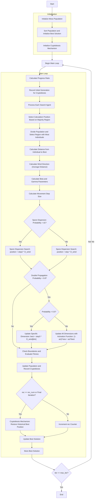

# Moss Growth Optimizer Algorithm Flowchart



### Detailed Step-by-Step Explanation:

1. **Initialize Moss Population**:
   - Randomly generate initial positions within the search space
   - Each position X_i ∈ [lb, ub]^dim
   - Calculate objective function value objective_func(X_i)

2. **Sort Population and Initialize Best Solution**:
   - Sort population based on fitness values
   - Select initial best solution

3. **Initialize Cryptobiosis Mechanism**:
   - Initialize memory to record position and fitness history
   - rM: Store position history
   - rM_cos: Store fitness history

4. **Main Loop** (max_iter times):
   - **Calculate Progress Ratio**:
     ```python
     progress_ratio = current_fes / max_fes
     ```

   - **Record Initial Generation for Cryptobiosis**:
     * Store initial positions and fitness values

   - **Select Calculation Position Based on Majority Region**:
     * Divide search space and select region with most individuals

   - **Calculate Distance and Wind Direction**:
     ```python
     D = best_solution.position - cal_positions
     D_wind = np.mean(D, axis=0)
     ```

   - **Calculate Beta and Gamma Parameters**:
     ```python
     beta = cal_positions.shape[0] / search_agents_no
     gamma = 1 / np.sqrt(1 - beta**2) if beta < 1 else 1.0
     ```

   - **Spore Dispersion Search**:
     * **If probability > d1**: Use step2
       ```python
       new_position = population[i].position + step2 * D_wind
       ```
     * **If probability <= d1**: Use step
       ```python
       new_position = population[i].position + step * D_wind
       ```

   - **Double Propagation Search**:
     * **Update Specific Dimension**:
       ```python
       new_position[dim_idx] = best_solution.position[dim_idx] + step3 * D_wind[dim_idx]
       ```
     * **Update All Dimensions with Activation Function**:
       ```python
       new_position = (1 - act) * new_position + act * best_solution.position
       ```

   - **Check Boundaries and Evaluate Fitness**:
     * Ensure positions remain within bounds [lb, ub]
     * Calculate objective function value for new position

   - **Cryptobiosis Mechanism**:
     * When sufficient records or final iteration, restore historical best position
     * Reset rec counter

   - **Update Best Solution**:
     * Compare and update if better solution is found

   - **Store Best Solution**:
     * Save best solution at each iteration

5. **End**:
   - Store final results
   - Display optimization history
   - Return best solution and history