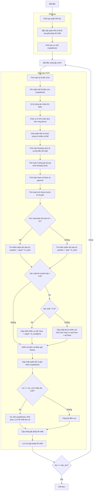

# Sơ đồ thuật toán Moss Growth Optimizer



### Giải thích chi tiết các bước:

1. **Khởi tạo quần thể rêu**: 
   - Tạo ngẫu nhiên các vị trí ban đầu trong không gian tìm kiếm
   - Mỗi vị trí X_i ∈ [lb, ub]^dim
   - Tính toán giá trị hàm mục tiêu objective_func(X_i)

2. **Sắp xếp quần thể và khởi tạo giải pháp tốt nhất**:
   - Sắp xếp quần thể dựa trên giá trị fitness
   - Chọn giải pháp tốt nhất ban đầu

3. **Khởi tạo cơ chế cryptobiosis**:
   - Khởi tạo bộ nhớ để ghi nhận lịch sử vị trí và fitness
   - rM: Lưu trữ lịch sử vị trí
   - rM_cos: Lưu trữ lịch sử fitness

4. **Vòng lặp chính** (max_iter lần):
   - **Tính toán tỷ lệ tiến trình**:
     ```python
     progress_ratio = current_fes / max_fes
     ```

   - **Ghi nhận thế hệ đầu cho cryptobiosis**:
     * Lưu trữ vị trí và fitness ban đầu

   - **Chọn vị trí tính toán dựa trên vùng đa số**:
     * Chia không gian tìm kiếm và chọn vùng có nhiều cá thể

   - **Tính toán khoảng cách và hướng gió**:
     ```python
     D = best_solution.position - cal_positions
     D_wind = np.mean(D, axis=0)
     ```

   - **Tính toán tham số beta và gamma**:
     ```python
     beta = cal_positions.shape[0] / search_agents_no
     gamma = 1 / np.sqrt(1 - beta**2) if beta < 1 else 1.0
     ```

   - **Tìm kiếm phân tán bào tử**:
     * **Nếu xác suất > d1**: Sử dụng step2
       ```python
       new_position = population[i].position + step2 * D_wind
       ```
     * **Nếu xác suất <= d1**: Sử dụng step
       ```python
       new_position = population[i].position + step * D_wind
       ```

   - **Tìm kiếm lan truyền kép**:
     * **Cập nhật chiều cụ thể**:
       ```python
       new_position[dim_idx] = best_solution.position[dim_idx] + step3 * D_wind[dim_idx]
       ```
     * **Cập nhật tất cả chiều với hàm kích hoạt**:
       ```python
       new_position = (1 - act) * new_position + act * best_solution.position
       ```

   - **Kiểm tra biên và đánh giá fitness**:
     * Đảm bảo vị trí nằm trong biên [lb, ub]
     * Tính toán giá trị hàm mục tiêu cho vị trí mới

   - **Cơ chế cryptobiosis**:
     * Khi đủ bản ghi hoặc iteration cuối, khôi phục vị trí tốt nhất lịch sử
     * Đặt lại bộ đếm rec

   - **Cập nhật giải pháp tốt nhất**:
     * So sánh và cập nhật nếu tìm thấy giải pháp tốt hơn

   - **Lưu trữ giải pháp tốt nhất**:
     * Lưu lại giải pháp tốt nhất tại mỗi iteration

5. **Kết thúc**:
   - Lưu trữ kết quả cuối cùng
   - Hiển thị lịch sử tối ưu hóa
   - Trả về giải pháp tốt nhất và lịch sử
