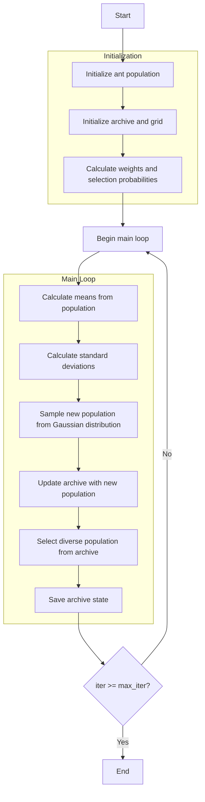

# Multi-Objective Ant Colony Optimizer Algorithm Flowchart



### Detailed Step-by-Step Explanation:

1. **Initialize ant population**:
   - Randomly generate initial positions within the search space
   - Each position X_i ∈ [lb, ub]^dim
   - Calculate multi-objective function values

2. **Initialize archive and grid**:
   - Identify non-dominated solutions from the initial population
   - Initialize archive with non-dominated solutions
   - Create grid to manage archive based on objective space

3. **Calculate weights and selection probabilities**:
   - Calculate Gaussian kernel weights for each solution
   ```python
   w = (1 / (np.sqrt(2 * np.pi) * self.q * n_pop)) * 
        np.exp(-0.5 * (((np.arange(n_pop)) / (self.q * n_pop)) ** 2))
   ```
   - Calculate selection probabilities
   ```python
   p = w / np.sum(w)
   ```

4. **Main loop** (max_iter times):
   - **Calculate means from population**:
     * Extract positions of all solutions in current population
     ```python
     means = np.array([member.position for member in population])
     ```

   - **Calculate standard deviations**:
     * Calculate standard deviation for each solution based on average distance
     ```python
     for l in range(n_pop):
         D = np.sum(np.abs(means[l] - means), axis=0)
         sigma[l] = self.zeta * D / (n_pop - 1)
     ```

   - **Sample new population from Gaussian distribution**:
     * Create new solutions by sampling from Gaussian distribution
     * For each solution component:
       - Select Gaussian kernel using roulette wheel selection
       - Generate Gaussian random variable
       ```python
       l = roulette_wheel_selection(probabilities)
       new_position[i] = means[l, i] + sigma[l, i] * np.random.randn()
       ```
     * Check boundaries and evaluate multi-objective fitness

   - **Update archive with new population**:
     * Add non-dominated solutions to archive
     * Maintain archive size by removing redundant solutions
     * Update grid to reflect new archive

   - **Select diverse population from archive**:
     * Use grid-based selection to choose diverse population
     * Prioritize grid cells with low density to maintain diversity
     * If archive is smaller than population size, supplement with random solutions

   - **Save archive state**:
     * Store current archive for optimization history

5. **End**:
   - Save final results
   - Return archive (set of Pareto optimal solutions) and history