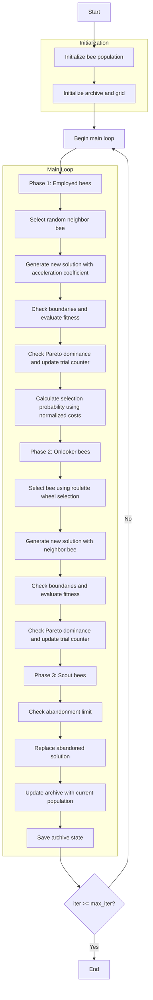

# Multi-Objective Artificial Bee Colony Optimizer Algorithm Flowchart



### Detailed Explanation of Steps:

1. **Initialize bee population**:
   - Randomly generate initial positions within the search space
   - Each position X_i ∈ [lb, ub]^dim
   - Calculate multi-objective function values
   - Initialize trial counter = 0 for each bee

2. **Initialize archive and grid**:
   - Identify non-dominated solutions from the initial population
   - Initialize archive with non-dominated solutions
   - Create grid to manage archive based on objective space

3. **Main loop** (max_iter times):
   - **Phase 1: Employed bees**:
     * Each employed bee searches for a new solution

     - **Select random neighbor bee**:
       * Randomly select another bee from the population

     - **Generate new solution with acceleration coefficient**:
       ```python
       phi = self.acceleration_coef * np.random.uniform(-1, 1, self.dim)
       new_position = population[i].position + phi * (population[i].position - population[k].position)
       ```

     - **Check boundaries and evaluate fitness**:
       * Ensure position remains within [lb, ub]
       * Calculate new multi-objective function values

     - **Check Pareto dominance and update trial counter**:
       * If new solution dominates current solution: update and reset trial counter
       * Otherwise: increment trial counter

   - **Calculate selection probability using normalized costs**:
     * Calculate sum of normalized objectives
     ```python
     normalized_costs = self._get_normalized_costs(population)
     fitness_values = 1.0 / (np.sum(normalized_costs, axis=1) + 1e-10)
     probabilities = fitness_values / np.sum(fitness_values)
     ```

   - **Phase 2: Onlooker bees**:
     * Onlooker bees select employed bees based on probability

     - **Select bee using roulette wheel selection**:
       * Use fitness-proportional selection

     - **Generate new solution with neighbor bee**:
       * Similar to employed bee phase

     - **Check boundaries and evaluate fitness**:
       * Ensure valid position

     - **Check Pareto dominance and update trial counter**:
       * Update solution if dominated

   - **Phase 3: Scout bees**:
     * Replace solutions that haven't improved

     - **Check abandonment limit**:
       * If trial counter >= abandonment_limit

     - **Replace abandoned solution**:
       * Generate new random solution
       * Reset trial counter

   - **Update archive with current population**:
     * Add non-dominated solutions to archive
     * Maintain archive size by removing redundant solutions
     * Update grid to reflect new archive

   - **Save archive state**:
     * Store current archive for optimization history

4. **End**:
   - Save final results
   - Return archive (set of Pareto optimal solutions) and history