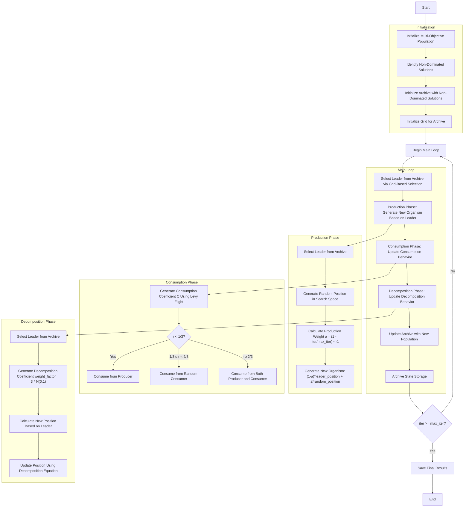

# Algorithm Flowchart for Multi-Objective Artificial Ecosystem Optimizer



### Detailed Step-by-Step Explanation:

1. **Initialize Multi-Objective Population**:
   - Randomly generate initial positions within the search space
   - Each organism has a position and a multi_fitness value
   - Calculate the multi-objective function value: objective_func(position)

2. **Identify Non-Dominated Solutions**:
   - Analyze the population to identify solutions not dominated by others
   - Utilize Pareto dominance relationships

3. **Initialize Archive**:
   - Initialize the archive with the initial non-dominated solutions
   - The archive stores the set of Pareto optimal solutions

4. **Initialize Grid**:
   - Create a grid system to manage the archive
   - Divide the objective space into hypercubes
   ```python
   self.grid = self._create_hypercubes(costs)
   ```

5. **Main Loop** (max_iter times):
   - **Select Leader**:
     * Choose a leader from the archive using grid-based selection
     * Prioritize less crowded grids
     ```python
     leader = self._select_leader()
     ```

   - **Production Phase**:
     * Generate a new organism based on the leader from the archive and a random position
     * Production weight decreases gradually with iterations
     ```python
     a = (1 - iter / max_iter) * r1
     new_position = (1 - a) * leader.position + a * random_position
     ```

   - **Consumption Phase**:
     * Organisms update their positions based on consumption behavior
     * Use consumption coefficient C calculated via Levy flight
     ```python
     C = 0.5 * self._levy_flight(self.dim)
     ```
     * Three consumption strategies:
       - Consume from producer (probability < 1/3)
       - Consume from a random consumer (1/3 ≤ probability < 2/3)
       - Consume from both producer and consumer (probability ≥ 2/3)

   - **Decomposition Phase**:
     * Organisms update their positions based on decomposition behavior
     * Use a leader from the archive to guide decomposition
     * Use decomposition coefficient weight_factor
     ```python
     weight_factor = 3 * np.random.normal(0, 1)
     new_position = leader.position + weight_factor * (
         (r3 * random_multiplier - 1) * leader.position -
         (2 * r3 - 1) * population[i].position
     )
     ```

   - **Update Archive**:
     * Add new non-dominated solutions to the archive
     * Maintain archive size and update the grid
     ```python
     self._add_to_archive(new_population)
     ```

   - **Archive State Storage**:
     * Save the current archive state to history

6. **Termination**:
   - Save the final results
   - Return the archive containing the set of Pareto optimal solutions