# Sơ đồ thuật toán Multi-Objective Artificial Ecosystem Optimizer

```mermaid
flowchart TD
    A["Bắt đầu"] --> B["Khởi tạo quần thể đa mục tiêu"]
    B --> C["Xác định các giải pháp không bị chi phối"]
    C --> D["Khởi tạo archive với giải pháp không bị chi phối"]
    D --> E["Khởi tạo grid cho archive"]
    E --> F["Bắt đầu vòng lặp chính"]
    F --> G["Chọn leader từ archive bằng grid-based selection"]
    G --> H["Giai đoạn sản xuất: tạo sinh vật mới dựa trên leader"]
    H --> I["Giai đoạn tiêu thụ: cập nhật hành vi tiêu thụ"]
    I --> J["Giai đoạn phân hủy: cập nhật hành vi phân hủy"]
    J --> K["Cập nhật archive với quần thể mới"]
    K --> L["Lưu trữ trạng thái archive"]
    L --> M{"iter >= max_iter?"}
    M -- "Chưa" --> F
    M -- "Rồi" --> N["Lưu trữ kết quả cuối cùng"]
    N --> O["Kết thúc"]
    
    subgraph Khởi tạo
    B
    C
    D
    E
    end
    
    subgraph Vòng lặp chính
    G
    H
    I
    J
    K
    L
    end
    
    subgraph Giai đoạn sản xuất
    H1["Chọn leader từ archive"]
    H2["Tạo vị trí ngẫu nhiên trong không gian tìm kiếm"]
    H3["Tính toán trọng số sản xuất a = (1 - iter/max_iter) * r1"]
    H4["Tạo sinh vật mới: (1-a)*leader_position + a*random_position"]
    H --> H1 --> H2 --> H3 --> H4
    end
    
    subgraph Giai đoạn tiêu thụ
    I1["Tạo hệ số tiêu thụ C sử dụng Levy flight"]
    I2{"r < 1/3?"}
    I2 -- "Có" --> I3["Tiêu thụ từ producer"]
    I2 -- "1/3 ≤ r < 2/3" --> I4["Tiêu thụ từ consumer ngẫu nhiên"]
    I2 -- "r ≥ 2/3" --> I5["Tiêu thụ từ cả producer và consumer"]
    I --> I1 --> I2
    end
    
    subgraph Giai đoạn phân hủy
    J1["Chọn leader từ archive"]
    J2["Tạo hệ số phân hủy weight_factor = 3 * N(0,1)"]
    J3["Tính toán vị trí mới dựa trên leader"]
    J4["Cập nhật vị trí sử dụng phương trình phân hủy"]
    J --> J1 --> J2 --> J3 --> J4
    end
```



### Giải thích chi tiết các bước:

1. **Khởi tạo quần thể đa mục tiêu**:
   - Tạo ngẫu nhiên các vị trí ban đầu trong không gian tìm kiếm
   - Mỗi sinh vật có vị trí và giá trị multi_fitness
   - Tính toán giá trị hàm mục tiêu đa mục tiêu objective_func(position)

2. **Xác định các giải pháp không bị chi phối**:
   - Phân tích quần thể để xác định các giải pháp không bị chi phối bởi giải pháp khác
   - Sử dụng quan hệ Pareto dominance

3. **Khởi tạo archive**:
   - Khởi tạo archive với các giải pháp không bị chi phối ban đầu
   - Archive lưu trữ tập các giải pháp Pareto optimal

4. **Khởi tạo grid**:
   - Tạo grid system để quản lý archive
   - Chia không gian mục tiêu thành các hypercubes
   ```python
   self.grid = self._create_hypercubes(costs)
   ```

5. **Vòng lặp chính** (max_iter lần):
   - **Chọn leader**:
     * Chọn leader từ archive sử dụng grid-based selection
     * Ưu tiên các grid ít đông đúc
     ```python
     leader = self._select_leader()
     ```

   - **Giai đoạn sản xuất**:
     * Tạo sinh vật mới dựa trên leader từ archive và vị trí ngẫu nhiên
     * Trọng số sản xuất giảm dần theo số lần lặp
     ```python
     a = (1 - iter / max_iter) * r1
     new_position = (1 - a) * leader.position + a * random_position
     ```

   - **Giai đoạn tiêu thụ**:
     * Các sinh vật cập nhật vị trí dựa trên hành vi tiêu thụ
     * Sử dụng hệ số tiêu thụ C tính bằng Levy flight
     ```python
     C = 0.5 * self._levy_flight(self.dim)
     ```
     * Ba chiến lược tiêu thụ:
       - Tiêu thụ từ producer (xác suất < 1/3)
       - Tiêu thụ từ consumer ngẫu nhiên (1/3 ≤ xác suất < 2/3)
       - Tiêu thụ từ cả producer và consumer (xác suất ≥ 2/3)

   - **Giai đoạn phân hủy**:
     * Các sinh vật cập nhật vị trí dựa trên hành vi phân hủy
     * Sử dụng leader từ archive để hướng dẫn phân hủy
     * Sử dụng hệ số phân hủy weight_factor
     ```python
     weight_factor = 3 * np.random.normal(0, 1)
     new_position = leader.position + weight_factor * (
         (r3 * random_multiplier - 1) * leader.position -
         (2 * r3 - 1) * population[i].position
     )
     ```

   - **Cập nhật archive**:
     * Thêm các giải pháp không bị chi phối mới vào archive
     * Duy trì kích thước archive và cập nhật grid
     ```python
     self._add_to_archive(new_population)
     ```

   - **Lưu trữ trạng thái archive**:
     * Lưu trạng thái archive hiện tại vào lịch sử

6. **Kết thúc**:
   - Lưu trữ kết quả cuối cùng
   - Trả về archive chứa tập các giải pháp Pareto optimal
