# Multi-Objective Bat Optimizer Algorithm Flowchart

```mermaid
flowchart TD
    A["Start"] --> B["Initialize Multi-Objective Bat Population"]
    B --> C["Identify Non-Dominated Solutions"]
    C --> D["Initialize Archive with Non-Dominated Solutions"]
    D --> E["Initialize Grid for Archive"]
    E --> F["Begin Main Loop"]
    F --> G["Select Leader from Archive using Grid-based Selection"]
    G --> H["Update Frequency f = fmin + (fmax - fmin) * random"]
    H --> I["Update Velocity v = v + (x - leader_x) * f"]
    I --> J["Update Position x = x + v"]
    J --> K["Check Boundaries and Update Position"]
    K --> L{"random > pulse_rate?"}
    L -- "Yes" --> M["Perform Random Walk x = leader_x + ε * mean_loudness"]
    L -- "No" --> N["Evaluate New Multi-Objective Fitness"]
    M --> N
    N --> O{"current does not dominate new and random < loudness?"}
    O -- "Yes" --> P["Update Position and Fitness"]
    P --> Q["Update Loudness and Pulse Rate"]
    Q --> R["Update Archive with Current Population"]
    O -- "No" --> R
    R --> S["Save Archive State"]
    S --> T{"iter >= max_iter?"}
    T -- "Not Yet" --> F
    T -- "Yes" --> U["Save Final Results"]
    U --> V["End"]
    
    subgraph Initialization
    B
    C
    D
    E
    end
    
    subgraph Main Loop
    G
    H
    I
    J
    K
    L
    M
    N
    O
    P
    Q
    R
    S
    end
```



### Detailed Step-by-Step Explanation:

1. **Initialize Multi-Objective Bat Population**:
   - Randomly generate initial positions within the search space
   - Each bat has parameters: position, multi_fitness, frequency, velocity, loudness, pulse_rate
   - Calculate multi-objective function values objective_func(position)

2. **Identify Non-Dominated Solutions**:
   - Analyze the population to identify solutions not dominated by others
   - Use Pareto dominance relationship

3. **Initialize Archive**:
   - Initialize archive with initial non-dominated solutions
   - Archive stores the set of Pareto optimal solutions

4. **Initialize Grid**:
   - Create grid system to manage the archive
   - Divide objective space into hypercubes
   ```python
   self.grid = self._create_hypercubes(costs)
   ```

5. **Main Loop** (max_iter times):
   - **Select Leader**:
     * Choose leader from archive using grid-based selection
     * Prioritize less crowded grids
     ```python
     leader = self._select_leader()
     ```

   - **Update Frequency**:
     * Each bat updates frequency randomly within [fmin, fmax] range
     ```python
     frequency = fmin + (fmax - fmin) * np.random.random()
     ```

   - **Update Velocity**:
     * Update velocity toward the leader
     ```python
     velocity = velocity + (position - leader.position) * frequency
     ```

   - **Update Position**:
     * Move bat according to new velocity
     ```python
     new_position = position + velocity
     ```

   - **Check Boundaries**:
     * Ensure position stays within [lb, ub] boundaries

   - **Random Walk**:
     * With probability (1 - pulse_rate), perform random walk
     ```python
     if np.random.random() > pulse_rate:
         epsilon = -1 + 2 * np.random.random()
         new_position = leader.position + epsilon * mean_loudness
     ```

   - **Evaluate New Multi-Objective Fitness**:
     * Calculate multi-objective function values for new position

   - **Update Solution**:
     * If new solution is not dominated by current solution and meets loudness condition
     ```python
     if not current_dominates_new and np.random.random() < loudness:
         # Update position and fitness
         # Update loudness and pulse rate
         loudness = alpha_loud * loudness
         pulse_rate = ro * (1 - np.exp(-gamma_pulse * iter))
     ```

   - **Update Archive**:
     * Add new non-dominated solutions to archive
     * Maintain archive size and update grid
     ```python
     self._add_to_archive(population)
     ```

   - **Save Archive State**:
     * Save current archive state to history

6. **Termination**:
   - Save final results
   - Return archive containing the set of Pareto optimal solutions