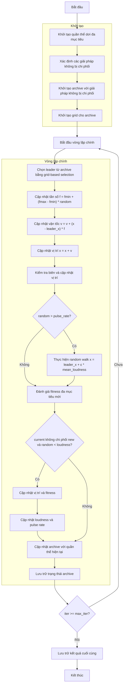

# Sơ đồ thuật toán Multi-Objective Bat Optimizer



### Giải thích chi tiết các bước:

1. **Khởi tạo quần thể dơi đa mục tiêu**:
   - Tạo ngẫu nhiên các vị trí ban đầu trong không gian tìm kiếm
   - Mỗi dơi có các tham số: vị trí, multi_fitness, tần số, vận tốc, loudness, pulse_rate
   - Tính toán giá trị hàm mục tiêu đa mục tiêu objective_func(position)

2. **Xác định các giải pháp không bị chi phối**:
   - Phân tích quần thể để xác định các giải pháp không bị chi phối bởi giải pháp khác
   - Sử dụng quan hệ Pareto dominance

3. **Khởi tạo archive**:
   - Khởi tạo archive với các giải pháp không bị chi phối ban đầu
   - Archive lưu trữ tập các giải pháp Pareto optimal

4. **Khởi tạo grid**:
   - Tạo grid system để quản lý archive
   - Chia không gian mục tiêu thành các hypercubes
   ```python
   self.grid = self._create_hypercubes(costs)
   ```

5. **Vòng lặp chính** (max_iter lần):
   - **Chọn leader**:
     * Chọn leader từ archive sử dụng grid-based selection
     * Ưu tiên các grid ít đông đúc
     ```python
     leader = self._select_leader()
     ```

   - **Cập nhật tần số**:
     * Mỗi dơi cập nhật tần số ngẫu nhiên trong khoảng [fmin, fmax]
     ```python
     frequency = fmin + (fmax - fmin) * np.random.random()
     ```

   - **Cập nhật vận tốc**:
     * Cập nhật vận tốc hướng về leader
     ```python
     velocity = velocity + (position - leader.position) * frequency
     ```

   - **Cập nhật vị trí**:
     * Di chuyển dơi theo vận tốc mới
     ```python
     new_position = position + velocity
     ```

   - **Kiểm tra biên**:
     * Đảm bảo vị trí nằm trong biên [lb, ub]

   - **Random walk**:
     * Với xác suất (1 - pulse_rate), thực hiện bước đi ngẫu nhiên
     ```python
     if np.random.random() > pulse_rate:
         epsilon = -1 + 2 * np.random.random()
         new_position = leader.position + epsilon * mean_loudness
     ```

   - **Đánh giá fitness đa mục tiêu mới**:
     * Tính toán giá trị hàm mục tiêu đa mục tiêu cho vị trí mới

   - **Cập nhật giải pháp**:
     * Nếu giải pháp mới không bị chi phối bởi giải pháp hiện tại và đáp ứng điều kiện loudness
     ```python
     if not current_dominates_new and np.random.random() < loudness:
         # Cập nhật vị trí và fitness
         # Cập nhật loudness và pulse rate
         loudness = alpha_loud * loudness
         pulse_rate = ro * (1 - np.exp(-gamma_pulse * iter))
     ```

   - **Cập nhật archive**:
     * Thêm các giải pháp không bị chi phối mới vào archive
     * Duy trì kích thước archive và cập nhật grid
     ```python
     self._add_to_archive(population)
     ```

   - **Lưu trữ trạng thái archive**:
     * Lưu trạng thái archive hiện tại vào lịch sử

6. **Kết thúc**:
   - Lưu trữ kết quả cuối cùng
   - Trả về archive chứa tập các giải pháp Pareto optimal
