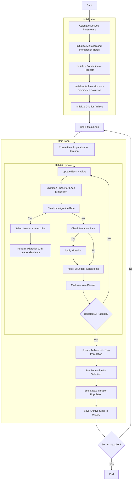

# Multi-Objective Biogeography-Based Optimizer Algorithm Flowchart



### Detailed Explanation of Steps:

1. **Calculate Derived Parameters**:
   - Calculate the number of habitats to retain (n_keep) based on keep_rate
   - Calculate the number of new habitats to create (n_new)
   ```python
   n_keep = round(self.keep_rate * search_agents_no)
   n_new = search_agents_no - n_keep
   ```

2. **Initialize Migration and Immigration Rates**:
   - Emigration rate decreases from 1 to 0
   - Immigration rate increases from 0 to 1
   ```python
   mu = np.linspace(1, 0, search_agents_no)  # Emigration rates
   lambda_rates = 1 - mu  # Immigration rates
   ```

3. **Initialize Population of Habitats**:
   - Randomly generate initial habitats
   - Each habitat has position X_i ∈ [lb, ub]^dim

4. **Initialize Archive with Non-Dominated Solutions**:
   - Identify non-dominated solutions in the initial population
   - Add these solutions to the archive

5. **Initialize Grid for Archive**:
   - Create hypercubes to manage the archive
   - Assign grid indices to each solution in the archive

6. **Create New Population for Iteration**:
   - Create a copy of the current population
   ```python
   new_population = [member.copy() for member in population]
   ```

7. **Update Each Habitat**:
   - Iterate through each habitat in the population

8. **Migration Phase for Each Dimension**:
   - Iterate through each dimension of the search space

9. **Check Immigration Rate**:
   - If random number ≤ immigration rate, perform migration
   ```python
   if np.random.random() <= lambda_rates[i]:
   ```

10. **Select Leader from Archive**:
    - Use grid-based selection to choose a leader from the archive
    - If archive is empty, randomly select from the population

11. **Perform Migration with Leader Guidance**:
    - Update position based on the leader
    ```python
    new_population[i].position[k] = (
        population[i].position[k] + 
        self.migration_alpha * (leader.position[k] - population[i].position[k])
    )
    ```

12. **Check Mutation Rate**:
    - If random number ≤ mutation probability, perform mutation
    ```python
    if np.random.random() <= self.p_mutation:
    ```

13. **Apply Mutation**:
    - Add Gaussian noise to the position
    ```python
    new_population[i].position[k] += self.sigma[k] * np.random.randn()
    ```

14. **Apply Boundary Constraints**:
    - Ensure position remains within bounds [lb, ub]
    ```python
    new_population[i].position = np.clip(new_population[i].position, self.lb, self.ub)
    ```

15. **Evaluate New Fitness**:
    - Calculate new multi-objective fitness values
    ```python
    new_population[i].multi_fitness = self.objective_func(new_population[i].position)
    ```

16. **Update Archive with New Population**:
    - Add new non-dominated solutions to the archive
    - Remove dominated solutions

17. **Sort Population for Selection**:
    - Sort population based on Pareto dominance
    ```python
    sorted_population_new = self._sort_population(new_population)
    sorted_population = self._sort_population(population)
    ```

18. **Select Next Iteration Population**:
    - Retain the best habitats from the old population
    - Add the best habitats from the new population
    ```python
    next_population = sorted_population[:n_keep] + sorted_population_new[:n_new]
    ```

19. **Save Archive State to History**:
    - Store a copy of the archive at each iteration

20. **End**:
    - Return archive history and final archive
    - Display optimization results