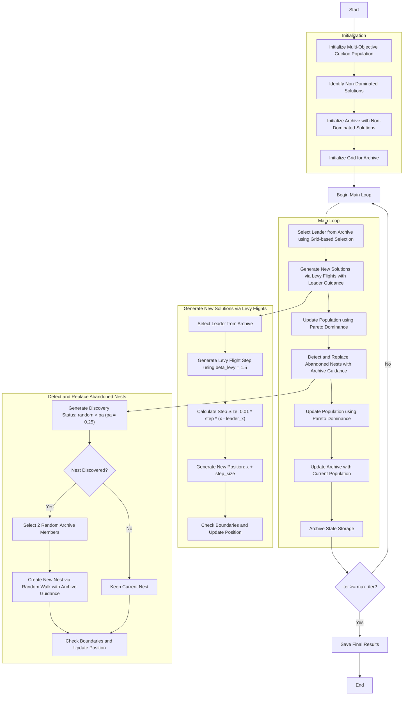

# Multi-Objective Cuckoo Search Optimizer Algorithm Flowchart



### Detailed Step-by-Step Explanation:

1. **Initialize Multi-Objective Cuckoo Population**:
   - Randomly generate initial positions within the search space
   - Each nest has a position and multi_fitness value
   - Calculate multi-objective function values: objective_func(position)

2. **Identify Non-Dominated Solutions**:
   - Analyze the population to identify solutions not dominated by others
   - Use Pareto dominance relationships

3. **Initialize Archive**:
   - Initialize archive with initial non-dominated solutions
   - Archive stores the set of Pareto optimal solutions

4. **Initialize Grid**:
   - Create grid system to manage the archive
   - Divide objective space into hypercubes
   ```python
   self.grid = self._create_hypercubes(costs)
   ```

5. **Main Loop** (max_iter iterations):
   - **Select Leader**:
     * Choose leader from archive using grid-based selection
     * Prioritize less crowded grids
     ```python
     leader = self._select_leader()
     ```

   - **Generate New Solutions via Levy Flights**:
     * Each nest creates new solutions using Levy flight guided by the leader
     * Use beta_levy = 1.5 coefficient for Levy flight
     ```python
     step = self._levy_flight()  # Using beta_levy = 1.5
     step_size = 0.01 * step * (member.position - leader.position)
     new_position = member.position + step_size
     ```
     * Check boundaries to ensure positions remain within [lb, ub]

   - **Update Population using Pareto Dominance**:
     * Compare new and current populations using Pareto dominance
     * Retain non-dominated solutions
     ```python
     if self._dominates(new, current):
         updated_population.append(new)
     elif self._dominates(current, new):
         updated_population.append(current)
     else:
         # Random selection if no dominance relationship
         if np.random.random() < 0.5:
             updated_population.append(new)
         else:
             updated_population.append(current)
     ```

   - **Detect and Replace Abandoned Nests**:
     * With probability pa = 0.25, nests are discovered and abandoned
     ```python
     discovery_status = np.random.random(n) > self.pa  # pa = 0.25
     ```
     * Create new nests via random walk with archive guidance:
     ```python
     if self.archive and len(self.archive) >= 2:
         idx1, idx2 = np.random.choice(len(self.archive), 2, replace=False)
         step_size = np.random.random() * (self.archive[idx1].position - self.archive[idx2].position)
     ```
     * Keep undiscovered nests unchanged

   - **Update Population using Pareto Dominance**:
     * Compare new and current populations using Pareto dominance
     * Retain non-dominated solutions

   - **Update Archive**:
     * Add new non-dominated solutions to the archive
     * Maintain archive size and update grid
     ```python
     self._add_to_archive(population)
     ```

   - **Archive State Storage**:
     * Save current archive state to history

6. **Termination**:
   - Save final results
   - Return archive containing the set of Pareto optimal solutions