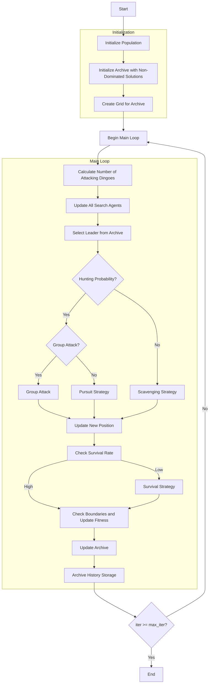

# Multi-Objective Dingo Optimizer Algorithm Flowchart



### Detailed Explanation of Steps:

1. **Initialize Population**:
   - Randomly generate initial positions within the search space
   - Each position X_i ∈ [lb, ub]^dim
   - Calculate multi-objective fitness values: multi_fitness = objective_func(X_i)

2. **Initialize Archive with Non-Dominated Solutions**:
   - Identify non-dominated solutions in the initial population
   - Add these solutions to the external archive

3. **Create Grid for Archive**:
   - Create hypercubes grid to manage the archive
   - Assign grid indices to each solution in the archive

4. **Main Loop** (max_iter times):
   - **Calculate Number of Attacking Dingoes**:
     ```python
     na = self._calculate_attacking_dingoes(search_agents_no)
     ```
   
   - **Select Leader from Archive**: Choose leader from archive using grid-based selection
   
   - **Determine Hunting Strategy**:
     * If random < p (0.5): execute hunting
       - If random < q (0.7): group attack
         ```python
         sumatory = self._group_attack(population, na, current_idx)
         new_position = beta1 * sumatory - leader.position
         ```
       - Else: pursuit
         ```python
         new_position = leader.position + beta1 * exp(beta2) * (population[r1].position - current.position)
         ```
     * Else: scavenging
       ```python
       new_position = (exp(beta2) * population[r1].position - ((-1)**binary_val) * current.position) / 2
       ```
   
   - **Check Survival Rate**:
     * If survival_rate <= 0.3: execute survival strategy
       ```python
       new_position = leader.position + (population[r1].position - ((-1)**binary_val) * population[r2].position) / 2
       ```
   
   - **Check Boundaries and Update Fitness**:
     * Ensure positions remain within boundaries [lb, ub]
     * Recalculate objective function values
   
   - **Update Archive**: Add new non-dominated solutions to the archive
   
   - **Archive History Storage**: Save current archive state

5. **End**:
   - Store final results
   - Return archive history and final archive