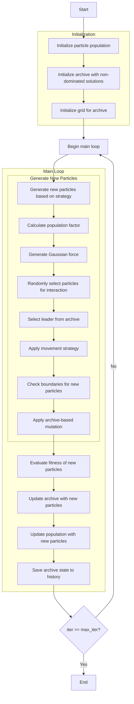

# Multi-Objective Electromagnetic Charged Particles Optimizer Algorithm Flowchart



### Detailed Step Explanations:

1. **Initialize particle population**:
   - Randomly generate initial positions within the search space
   - Each particle has position X_i ∈ [lb, ub]^dim

2. **Initialize archive with non-dominated solutions**:
   - Identify non-dominated solutions in the initial population
   - Add these solutions to the archive

3. **Initialize grid for archive**:
   - Create hypercubes to manage the archive
   - Assign grid indices to each solution in the archive

4. **Calculate population factor**:
   - Calculate the number of new particles to generate based on strategy
   ```python
   if self.strategy == 1:
       pop_factor = 2 * self._n_choose_2(self.npi)
   elif self.strategy == 2:
       pop_factor = self.npi
   else:  # strategy == 3
       pop_factor = 2 * self._n_choose_2(self.npi) + self.npi
   ```

5. **Generate Gaussian force**:
   - Generate random force following Gaussian distribution
   ```python
   force = np.random.normal(0.7, 0.2)
   ```

6. **Randomly select particles for interaction**:
   - Randomly select NPI particles from the population
   ```python
   selected_indices = np.random.choice(len(population), self.npi, replace=False)
   selected_particles = [population[i] for i in selected_indices]
   ```

7. **Select leader from archive**:
   - Use grid-based selection to choose leader from archive
   - If archive is empty, select best particle from selected particles
   ```python
   leader = self._select_leader()
   if leader is None:
       leader = self._get_best_from_population(selected_particles)
   ```

8. **Apply movement strategy**:
   - **Strategy 1**: Pairwise interactions between particles
   - **Strategy 2**: Combined interactions from all particles
   - **Strategy 3**: Hybrid approach with two movement types

9. **Check boundaries for new particles**:
   - Ensure particle positions remain within [lb, ub] boundaries
   ```python
   for particle in new_particles:
       particle.position = np.clip(particle.position, self.lb, self.ub)
   ```

10. **Apply archive-based mutation**:
    - With 20% probability, replace dimension with value from random archive member
    ```python
    if np.random.random() < 0.2:
        archive_member = np.random.choice(self.archive)
        particle.position[j] = archive_member.position[j]
    ```

11. **Evaluate fitness of new particles**:
    - Calculate multi-objective fitness values for new particles
    ```python
    for particle in new_particles:
        particle.multi_fitness = self.objective_func(particle.position)
    ```

12. **Update archive with new particles**:
    - Add new non-dominated solutions to archive
    - Remove dominated solutions
    ```python
    self._add_to_archive(new_particles)
    ```

13. **Update population with new particles**:
    - Replace dominated particles with new particles
    ```python
    self._update_population(population, new_particles)
    ```

14. **Save archive state to history**:
    - Store copy of archive at each iteration
    ```python
    history_archive.append([member.copy() for member in self.archive])
    ```

15. **End**:
    - Return archive history and final archive
    - Display optimization results

### Movement Strategies:

#### Strategy 1: Pairwise Interactions
```python
for i in range(self.npi):
    for j in range(self.npi):
        if i == j:
            continue
        new_position += force * (leader.position - selected_particles[i].position)
        if j < i:
            new_position += force * (selected_particles[j].position - selected_particles[i].position)
        else:
            new_position -= force * (selected_particles[j].position - selected_particles[i].position)
```

#### Strategy 2: Combined Interactions
```python
for i in range(self.npi):
    new_position += 0 * force * (leader.position - selected_particles[i].position)
    for j in range(self.npi):
        if j < i:
            new_position += force * (selected_particles[j].position - selected_particles[i].position)
        elif j > i:
            new_position -= force * (selected_particles[j].position - selected_particles[i].position)
```

#### Strategy 3: Hybrid Approach
```python
# Type 1 movement (similar to strategy 1)
s1_position += force * (leader.position - selected_particles[i].position)
# Type 2 movement (full force toward leader)
s2_position += 1 * force * (leader.position - selected_particles[i].position)
```

### Important Parameters:
- **strategy**: Movement strategy (1, 2, or 3)
- **npi**: Number of particles for interaction
- **force**: Electromagnetic force (Gaussian distribution)
- **archive_size**: Archive size