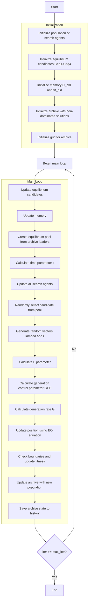

# Multi-Objective Equilibrium Optimizer Algorithm Flowchart



### Detailed Explanation of Steps:

1. **Initialize population of search agents**:
   - Randomly generate initial positions within the search space
   - Each agent has position X_i ∈ [lb, ub]^dim

2. **Initialize equilibrium candidates Ceq1-Ceq4**:
   - Initialize 4 equilibrium candidates with initial values
   ```python
   Ceq1 = EquilibriumMultiMember(np.zeros(self.dim), np.full(self.n_objectives, np.inf if not self.maximize else -np.inf))
   Ceq2 = EquilibriumMultiMember(np.zeros(self.dim), np.full(self.n_objectives, np.inf if not self.maximize else -np.inf))
   Ceq3 = EquilibriumMultiMember(np.zeros(self.dim), np.full(self.n_objectives, np.inf if not self.maximize else -np.inf))
   Ceq4 = EquilibriumMultiMember(np.zeros(self.dim), np.full(self.n_objectives, np.inf if not self.maximize else -np.inf))
   ```

3. **Initialize memory C_old and fit_old**:
   - Initialize memory for previous population and fitness
   ```python
   C_old = [member.copy() for member in population]
   fit_old = np.array([member.multi_fitness for member in population])
   ```

4. **Initialize archive with non-dominated solutions**:
   - Identify non-dominated solutions in the initial population
   - Add these solutions to the archive

5. **Initialize grid for archive**:
   - Create hypercubes to manage the archive
   - Assign grid indices to each solution in the archive

6. **Update equilibrium candidates**:
   - Update the 4 best candidates based on Pareto dominance
   ```python
   if self._dominates(member, Ceq1):
       Ceq4 = Ceq3.copy()
       Ceq3 = Ceq2.copy()
       Ceq2 = Ceq1.copy()
       Ceq1 = member.copy()
   ```

7. **Update memory**:
   - Compare current population with memory
   - Retain better solutions from memory
   ```python
   if self._dominates(old_member, population[i]):
       population[i].multi_fitness = fit_old[i]
       population[i].position = C_old[i].position.copy()
   ```

8. **Create equilibrium pool from archive leaders**:
   - Select 4 diverse leaders from the archive
   - Create average candidate (Ceq_ave)
   ```python
   leaders = self._select_multiple_leaders(4)
   Ceq_ave_pos = (Ceq1_arch.position + Ceq2_arch.position + Ceq3_arch.position + Ceq4_arch.position) / 4
   Ceq_pool = [Ceq1_arch, Ceq2_arch, Ceq3_arch, Ceq4_arch, Ceq_ave]
   ```

9. **Calculate time parameter t**:
   - Calculate decreasing time parameter based on iteration
   ```python
   t = (1 - iter / max_iter) ** (self.a2 * iter / max_iter)
   ```

10. **Randomly select candidate from pool**:
    - Randomly select one candidate from the equilibrium pool
    ```python
    Ceq = np.random.choice(Ceq_pool)
    ```

11. **Generate random vectors lambda and r**:
    - Generate random vectors lambda and r
    ```python
    lambda_vec = np.random.random(self.dim)
    r = np.random.random(self.dim)
    ```

12. **Calculate F parameter**:
    - Calculate F parameter for the EO equation
    ```python
    F = self.a1 * np.sign(r - 0.5) * (np.exp(-lambda_vec * t) - 1)
    ```

13. **Calculate generation control parameter GCP**:
    - Calculate generation control parameter
    ```python
    GCP = 0.5 * r1 * np.ones(self.dim) * (r2 >= self.GP)
    ```

14. **Calculate generation rate G**:
    - Calculate generation rate
    ```python
    G0 = GCP * (Ceq.position - lambda_vec * population[i].position)
    G = G0 * F
    ```

15. **Update position using EO equation**:
    - Update position using the main EO equation
    ```python
    new_position = Ceq.position + \
                  (population[i].position - Ceq.position) * F + \
                  (G / (lambda_vec * 1.0)) * (1 - F)
    ```

16. **Check boundaries and update fitness**:
    - Ensure position stays within bounds [lb, ub]
    - Calculate new multi-objective fitness values
    ```python
    new_position = np.clip(new_position, self.lb, self.ub)
    population[i].position = new_position
    population[i].multi_fitness = self.objective_func(new_position)
    ```

17. **Update archive with new population**:
    - Add new non-dominated solutions to the archive
    - Remove dominated solutions
    ```python
    self._add_to_archive(population)
    ```

18. **Save archive state to history**:
    - Store a copy of the archive at each iteration
    ```python
    history_archive.append([member.copy() for member in self.archive])
    ```

19. **End**:
    - Return archive history and final archive
    - Display optimization results

### Main EO Equation:
```python
new_position = Ceq.position + \
              (current.position - Ceq.position) * F + \
              (G / (lambda_vec * 1.0)) * (1 - F)
```

### Important Parameters:
- **a1**: Exploration parameter
- **a2**: Exploitation parameter  
- **GP**: Generation probability
- **t**: Time parameter (decreases with iteration)
- **F**: Exploration/exploitation balance parameter
- **G**: Generation rate parameter

### Features of Multi-Objective EO:
- Simulates dynamic equilibrium in physical systems
- Uses equilibrium pool with 4 best candidates + 1 average candidate
- Memory mechanism to store good solutions
- Archive management for multi-objective optimization
- Combines exploration and exploitation through parameter F
- Generation rate G to produce new solutions