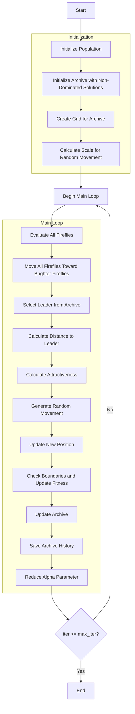

# Multi-Objective Firefly Optimizer Algorithm Flowchart



### Detailed Explanation of Steps:

1. **Initialize Population**: 
   - Randomly generate initial positions within the search space
   - Each position X_i ∈ [lb, ub]^dim
   - Calculate multi-objective fitness value = objective_func(X_i)

2. **Initialize Archive with Non-Dominated Solutions**:
   - Identify non-dominated solutions in the initial population
   - Add these solutions to the external archive

3. **Create Grid for Archive**:
   - Create hypercubes grid to manage the archive
   - Assign grid index to each solution in the archive

4. **Calculate Scale for Random Movement**:
   ```python
   scale = np.abs(self.ub - self.lb)
   ```

5. **Main Loop** (max_iter times):
   - **Evaluate All Fireflies**: Recalculate objective function values for each firefly
   
   - **Move All Fireflies Toward Brighter Fireflies**:
     * Select leader from archive using grid-based selection
     * Calculate Euclidean distance to leader:
       ```python
       r = np.sqrt(np.sum((current.position - leader.position)**2))
       ```
     * Calculate attractiveness:
       ```python
       beta = (1.0 - betamin) * exp(-gamma * r**2) + betamin
       ```
     * Generate random movement:
       ```python
       random_move = alpha * (np.random.random(dim) - 0.5) * scale
       ```
     * Update position:
       ```python
       new_position = current.position * (1 - beta) + leader.position * beta + random_move
       ```
   
   - **Check Boundaries and Update Fitness**:
     * Ensure positions remain within bounds [lb, ub]
     * Recalculate objective function values
   
   - **Update Archive**: Add new non-dominated solutions to the archive
   
   - **Save Archive History**: Record current archive state
   
   - **Reduce Alpha Parameter**: Decrease randomness over time:
     ```python
     alpha = alpha * alpha_delta
     ```

6. **End**:
   - Save final results
   - Return archive history and final archive