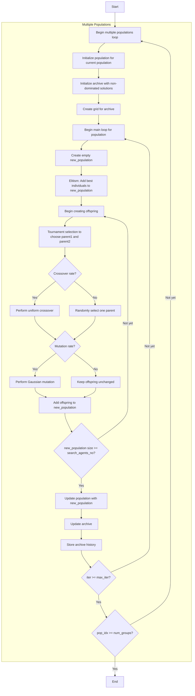

# Multi-Objective Genetic Algorithm Optimizer Flowchart



### Detailed Explanation of Steps:

1. **Begin multiple populations loop** (num_groups times):
   - Run multiple independent populations to increase diversity
   - Each population has its own evolutionary process

2. **Initialize population for current population**: 
   - Randomly generate initial positions
   - Each position X_i ∈ [lb, ub]^dim
   - Calculate multi-objective function value multi_fitness = objective_func(X_i)

3. **Initialize archive with non-dominated solutions**:
   - Identify non-dominated solutions in the initial population
   - Add these solutions to the external archive

4. **Create grid for archive**:
   - Create hypercubes grid to manage the archive
   - Assign grid index to each solution in the archive

5. **Main loop for population** (max_iter times):
   - **Create empty new_population**: Prepare new population
   
   - **Elitism: Add best individuals to new_population**:
     * Retain the best solutions from the current population
     * Elitism count: search_agents_no // 4
     ```python
     elite_count = min(len(non_dominated_pop), search_agents_no // 4)
     new_population.extend(non_dominated_pop[:elite_count])
     ```
   
   - **Begin creating offspring**: Create offspring until population size is sufficient
   
   - **Tournament selection to choose parent1 and parent2**:
     * Use tournament selection with tournament_size
     * Tournament selection uses grid-based diversity for multi-objective
     ```python
     parent1 = self._tournament_selection_multi(population, self.tournament_size)
     parent2 = self._tournament_selection_multi(population, self.tournament_size)
     ```
   
   - **Crossover decision**:
     * With crossover_rate probability: perform uniform crossover
     * Otherwise: randomly select one parent
     ```python
     if np.random.random() < self.crossover_rate:
         child = self._uniform_crossover(parent1, parent2)
     else:
         child = parent1.copy() if np.random.random() < 0.5 else parent2.copy()
     ```
   
   - **Mutation decision**:
     * With mutation_rate probability: perform Gaussian mutation
     * Otherwise: keep offspring unchanged
     ```python
     if np.random.random() < self.mutation_rate:
         child = self._mutation(child)
     ```
   
   - **Add offspring to new_population**: Add created offspring
   
   - **Update population with new_population**: Replace old population
   
   - **Update archive**: Add new non-dominated solutions to archive
   
   - **Store archive history**: Save current archive state

6. **End**:
   - Store final results
   - Return archive history and final archive

### Genetic Operators Details:

**Uniform Crossover**:
```python
def _uniform_crossover(self, parent1, parent2):
    child_position = np.zeros(self.dim)
    for d in range(self.dim):
        if np.random.random() < 0.5:  # 50% chance from each parent
            child_position[d] = parent1.position[d]
        else:
            child_position[d] = parent2.position[d]
    return MultiObjectiveMember(child_position, self.objective_func(child_position))
```

**Gaussian Mutation**:
```python
def _mutation(self, individual):
    mutated_position = individual.position.copy()
    for d in range(self.dim):
        if np.random.random() < self.mutation_rate:
            mutation_strength = 0.1 * (self.ub[d] - self.lb[d])
            mutated_position[d] += np.random.normal(0, mutation_strength)
    return MultiObjectiveMember(mutated_position, self.objective_func(mutated_position))
```

**Tournament Selection (Multi-Objective)**:
- Use grid-based diversity to select parents
- Prefer solutions from less crowded grid cells
- Combine non-dominated sorting and diversity maintenance

### Genetic Algorithm Parameters:

**Main parameters**:
- `num_groups` (5): Number of independent populations
- `crossover_rate` (0.8): Crossover probability
- `mutation_rate` (0.1): Mutation probability  
- `tournament_size` (3): Tournament selection size

**Multi-objective GA characteristics**:
- Use multiple populations to increase diversity
- Elitism to preserve good solutions
- Tournament selection with grid-based diversity
- Archive management to maintain Pareto front
- Uniform crossover and Gaussian mutation for variation