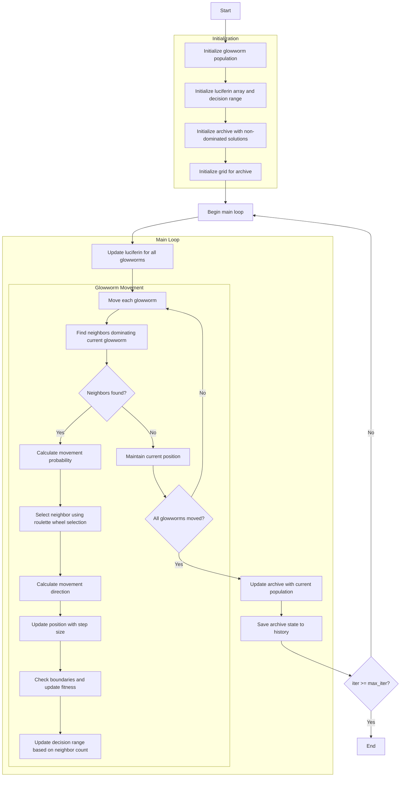

# Algorithm Flowchart for Multi-Objective Glowworm Swarm Optimizer



### Detailed Step-by-Step Explanation:

1. **Initialize glowworm population**:
   - Randomly generate initial positions within the search space
   - Each glowworm has position X_i ∈ [lb, ub]^dim
   - Initialize with initial luciferin and decision range
   ```python
   population = []
   for _ in range(search_agents_no):
       position = np.random.uniform(self.lb, self.ub, self.dim)
       fitness = self.objective_func(position)
       population.append(GlowwormMultiMember(position, fitness, self.L0, self.r0))
   ```

2. **Initialize luciferin array and decision range**:
   - Initialize luciferin array with initial value L0
   - Initialize decision range array with initial value r0
   ```python
   self.luciferin = np.array([self.L0] * search_agents_no)
   self.decision_range = np.array([self.r0] * search_agents_no)
   ```

3. **Initialize archive with non-dominated solutions**:
   - Identify non-dominated solutions in the initial population
   - Add these solutions to the archive

4. **Initialize grid for archive**:
   - Create hypercubes to manage the archive
   - Assign grid indices to each solution in the archive

5. **Update luciferin for all glowworms**:
   - Update luciferin values based on multi-objective fitness
   ```python
   for i, member in enumerate(population):
       self.luciferin[i] = (1 - self.rho) * self.luciferin[i] + self.gamma * self._calculate_luciferin(member)
   ```

6. **Find neighbors dominating current glowworm**:
   - Find neighbors within decision range that dominate the current glowworm
   - Only consider neighbors with higher luciferin
   ```python
   neighbors = self._get_neighbors(i, population)
   ```

7. **Calculate movement probability**:
   - Movement probability proportional to luciferin difference
   ```python
   probabilities = (neighbor_luciferin - current_luciferin) / np.sum(neighbor_luciferin - current_luciferin)
   ```

8. **Select neighbor using roulette wheel selection**:
   - Choose a neighbor to move toward
   ```python
   selected_neighbor_idx = self._roulette_wheel_selection(probabilities)
   ```

9. **Calculate movement direction**:
   - Calculate direction vector from current glowworm to selected neighbor
   ```python
   direction = neighbor_pos - current_pos
   distance = self._euclidean_distance(current_pos, neighbor_pos)
   ```

10. **Update position with step size**:
    - Move glowworm with step size s in the calculated direction
    ```python
    direction_normalized = direction / distance
    new_position = current_pos + self.s * direction_normalized
    ```

11. **Check boundaries and update fitness**:
    - Ensure position remains within bounds [lb, ub]
    - Calculate new multi-objective fitness values
    ```python
    new_position = np.clip(new_position, self.lb, self.ub)
    population[i].position = new_position
    population[i].multi_fitness = self.objective_func(new_position)
    ```

12. **Update decision range based on neighbor count**:
    - Adjust decision range based on number of neighbors
    ```python
    self.decision_range[i] = min(self.rs, max(0, self.decision_range[i] + self.beta * (self.nt - neighbor_count)))
    ```

13. **Update archive with current population**:
    - Add new non-dominated solutions to the archive
    - Remove dominated solutions
    ```python
    self._add_to_archive(population)
    ```

14. **Save archive state to history**:
    - Store a copy of the archive at each iteration
    ```python
    history_archive.append([member.copy() for member in self.archive])
    ```

15. **End**:
    - Return archive history and final archive
    - Display optimization results

### Key Parameters:
- **L0**: Initial luciferin value
- **r0**: Initial decision range
- **rho**: Luciferin decay constant
- **gamma**: Luciferin enhancement constant
- **beta**: Decision range update constant
- **s**: Step size for movement
- **rs**: Maximum sensing range
- **nt**: Desired number of neighbors

### Characteristics of Multi-Objective GSO:
- Uses Pareto dominance to determine valid neighbors
- Luciferin calculated based on multi-objective fitness
- Decision range automatically adjusts based on neighbor density
- Archive management to maintain solution diversity