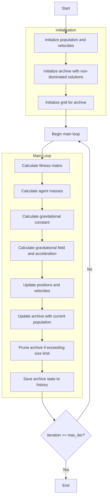

# Multi-Objective Gravitational Search Optimizer Algorithm Flowchart



### Detailed Explanation of Steps:

1. **Initialize population and velocities**:
   - Randomly generate initial positions within the search space
   - Initialize initial velocities to zero for all agents
   - Each agent has position X_i ∈ [lb, ub]^dim and velocity V_i

2. **Initialize archive with non-dominated solutions**:
   - Identify non-dominated solutions in the initial population
   - Add these solutions to the archive

3. **Initialize grid for archive**:
   - Create hypercubes to manage the archive
   - Assign grid indices to each solution in the archive

4. **Calculate fitness matrix**:
   - Extract multi-objective fitness values from the population
   ```python
   fitness_matrix = np.array([member.multi_fitness for member in population])
   ```

5. **Calculate agent masses**:
   - Calculate masses based on multi-objective fitness
   - Normalize fitness values and compute totals
   ```python
   masses = self._mass_calculation(fitness_matrix)
   ```

6. **Calculate gravitational constant**:
   - Gravitational constant decreases with iterations
   ```python
   g = self.g0 * np.exp(-self.alpha * float(iteration) / max_iter)
   ```

7. **Calculate gravitational field and acceleration**:
   - Compute gravitational forces between agents
   - Determine kbest top agents to consider
   - Calculate acceleration for each agent

8. **Update positions and velocities**:
   - Update velocities based on acceleration
   - Update positions based on velocities
   - Ensure positions remain within bounds [lb, ub]
   ```python
   self.velocities[i, d] = rand_val * self.velocities[i, d] + accelerations[i, d]
   positions[i, d] = positions[i, d] + self.velocities[i, d]
   ```

9. **Update archive with current population**:
   - Add new non-dominated solutions to the archive
   - Remove dominated solutions from the archive

10. **Prune archive if exceeding size limit**:
    - Use grid-based selection to maintain archive size
    - Prioritize keeping solutions in less crowded hypercubes

11. **Save archive state to history**:
    - Store a copy of the archive at each iteration to track progress

12. **End**:
    - Return archive history and final archive
    - Display optimization results